# 数据准备

## 从网上下载数据，并显示1-10行

如果要使用自己的数据，可以通过菜单栏的

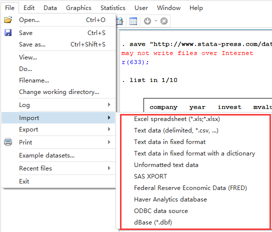

自行导入，或者自行修改相关数据


```
webuse grunfeld 
list in 1/10
```


## 设置面板数据

```stata
xtset company year,yearly // company为面板数据变量，year为时间变量，yearly 时间变量year的单位，yearly表示以年为单位
```


同理，时间单位有其他选项如下：

```
  (default)             timevar's units from timevar's display format

    clocktime             timevar is %tc:  0 = 1jan1960 00:00:00.000,
                            1 = 1jan1960 00:00:00.001, ...
    daily                 timevar is %td:  0 = 1jan1960, 1 = 2jan1960, ...
    weekly                timevar is %tw:  0 = 1960w1, 1 = 1960w2, ...
    monthly               timevar is %tm:  0 = 1960m1, 1 = 1960m2, ...
    quarterly             timevar is %tq:  0 = 1960q1, 1 = 1960q2, ...
    halfyearly            timevar is %th:  0 = 1960h1, 1 = 1960h2, ...
    yearly                timevar is %ty:  1960 = 1960, 1961 = 1961, ...
    generic               timevar is %tg:  0 = ?, 1 = ?, ...

    format(%fmt)          specify timevar's format and then apply default
                            rule
```

`xtset` 的作用是申明数据为面板数据，有两种形式

       xtset panelvar
       xtset panelvar timevar [, tsoptions]

其他指令：

```
xtset : Display how data are currently xtset
xtset, clear : Clear xt settings
```

# 模型检验

## 个体效应和随机效应的联合显著性检验


这一句的意思，猜测xtreg使用的就是这个公式，通过不同的自变量因变量参数进行系数估计，从而得出公式（模型）。

```stata
help xtreg
```


[文中](https://www.jianshu.com/p/e103270ce674)提到了两种方式,使用的变量名来自数据的列名

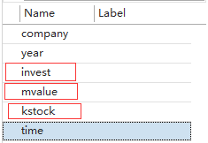

```stata
xtreg invest mvalue kstock,fe //fe表示固定效应
//若同时包括时期虚拟变量，xtreg invest mvalue kstock i.year,fe，利用 testparm 检验 
xtreg invest mvalue kstock,re //re表示随机效应
xttest0  //检验随机效应是否显著，需要运行随机效应模型后使用
```


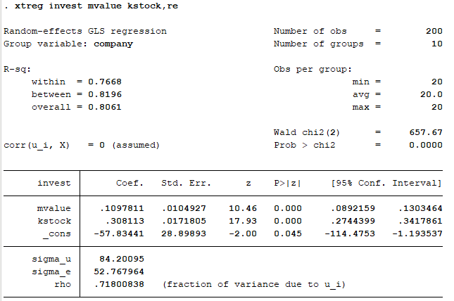

**得出的这些参数具体是啥意思，可能需要专业知识来解答**。比如 Coef 应该是 系数的意思， Std.Err 应该是标准差等等

## Hausman检验

涉及代码

```stata
xtreg invest mvalue kstock,fe
est store fe_result
xtreg invest mvalue kstock,re
est store re_result
hausman fe_result re_result
```

通过 help est 和help hausman 可知

`est store fe_result` 相当于把 `xtreg invest mvalue kstock,fe` 得出的结果保存到 `fe_result` 变量,至于hausman的使用，简书中有提到，使用help huasman在后面也有相关的示例。怎样甄别 **一致估计  和 有效估计**应该有参数指标，姑娘，统计学我没学好，看你自己研究了。


## 异方差和序列相关检验

`xtserial`默认是没有安装该指令的，安装流程如下

在命令窗口输入 `findit xtserial`

会弹窗如下：

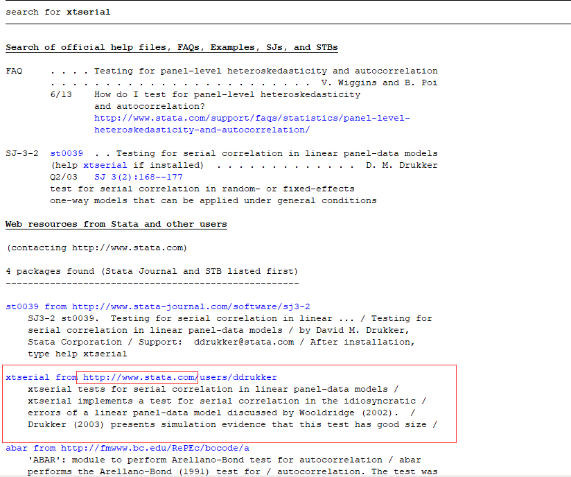

讲道理，选官网的肯定没错，所以我选择的官网的。点击该链接，后会转到另一个窗口：

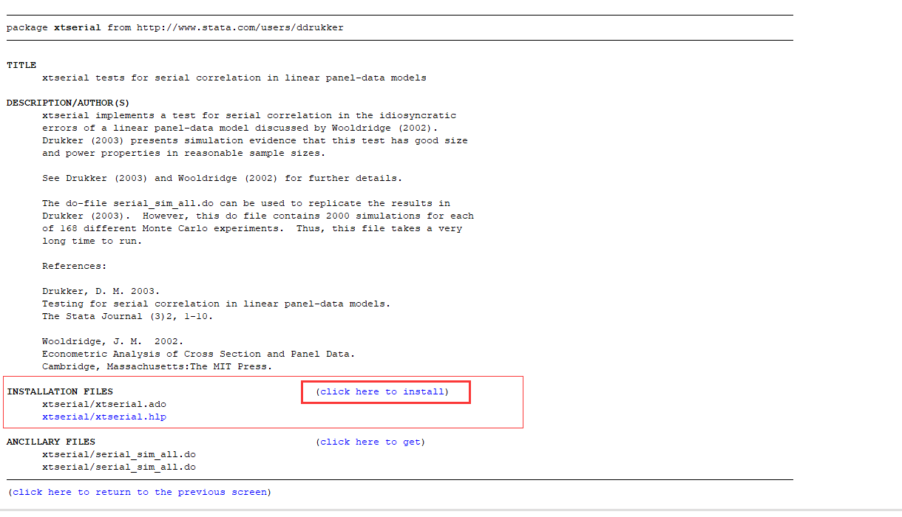

点击红框安装就好，想看源码的点下面get慢慢折腾，哈哈。点击后，显示如下页面就代表安装成功了。


此时再输入代码,就不会报错了。

```stat
xtserial invest mvalue kstock
```

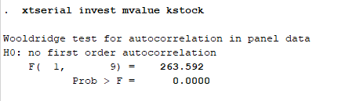

然后后面继续运行，发现 `xttest1`、`xttest3`也都显示 **command xttest1 is unrecognized** 没有安装，安装之前流程**依次**输入，并按照流程安装对应指令。选择的时候，优先选择www.stata.com来源，其次 http://www.stata-journal.com/ 来源，两个都没有再选其他的，其实都是大同小异，解释都差不多。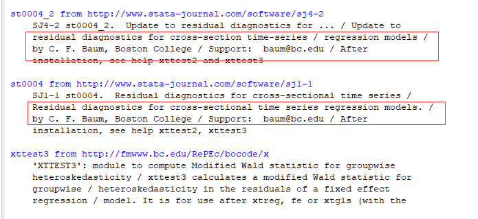

```stata
findit xttest1
//       
findit xttest2
```

```stata
xtreg invest mvalue kstock,fe
xttest3
// 这些代码我就不详细跑和截图了，简书的文章里面有对应解释。
```

###  `xtserial` 用法: 

用来完成检测在线性面板数据模型中的特异性错误的序列相关性

**depvar:**因变量，差不多就是 y 的意思

**indepvars:**自变量，后面有s，说明可以输入多个

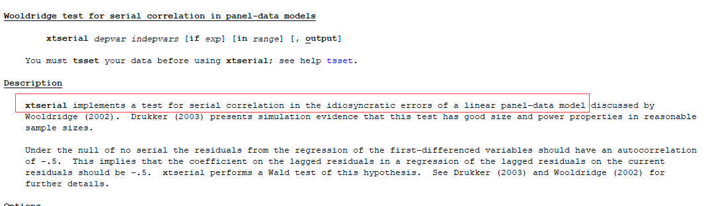

## 模型选择及其他方法

### 稳健 Hausman检验

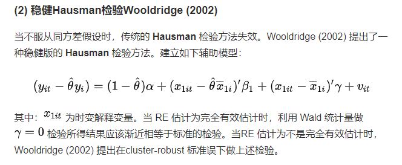

```stata
webuse grunfeld, clear 
xtset company year
quiet xtreg invest mvalue kstock,re
scalar theta = e(theta) //声明变量 theta,就是公式里面的 
global xlist2 invest mvalue kstock //把 invest mvalue kstock 都赋给 xlist2 方便后面统一操作
sort company // 一看名字就知道是排序
foreach x of varlist $xlist2 { // 对xlist2的每一个（即invest mvalue kstock）数据进行处理，
     by company: egen mean`x' = mean(`x')
     generate md`x' = `x' - mean`x' 
     generate red`x' = `x' - theta*mean`x'
      }
quiet reg redinvest redmvalue redkstock mdmvalue mdkstock, vce(cluster company)// 线性回归
test mdmvalue mdkstock // 测试在估计后的线性假设
```

上面第四行的 theta就是公式里面的 $\theta$  

`foreach x of varlist $xlist2`这里相当于把公式替代，因为reg默认的公式是 $y_{it}=\alpha + \beta_1x_{1i} + \gamma x_{1i} + v_{it}​$,所以需要将对应部分先额外处理。

实现的公式呢，就是这个，**考虑到熟悉程度不同，尽可能在每次独立的模型测试，都确保下数据，要么在数据编辑器里面查看数据，要么通通重新导入数据（需要上一次计算结果的除外）**

> reg 指令的使用，线性回归的意思，还是填空题，填的还是因变量和自变量
>
>  **regress depvar [indepvars] [if] [in] [weight] [, options]**
>
>  options               Description
>     -------------------------------------------------------------------------------------------------------------------------------
> ​    Model
> ​      noconstant          suppress constant term
> ​      hascons             has user-supplied constant
> ​      tsscons             compute total sum of squares with constant; seldom used
>
>     SE/Robust
>       vce(vcetype)        vcetype may be ols, robust, cluster clustvar, bootstrap, jackknife, hc2, or hc3
>     
>     Reporting
>       level(#)            set confidence level; default is level(95)
>       beta                report standardized beta coefficients
>       eform(string)       report exponentiated coefficients and label as string
>       depname(varname)    substitute dependent variable name; programmer's option
>       display_options     control columns and column formats, row spacing, line width, display of omitted variables and base and
>                             empty cells, and factor-variable labeling
>     
>       noheader            suppress output header
>       notable             suppress coefficient table
>       plus                make table extendable
>       mse1                force mean squared error to 1
>       coeflegend          display legend instead of statistics
>     ----------------------------------------------------------------------------------------------------
>  vce(vcetype) specifies the type of standard error reported, which includes types that are derived from asymptotic theory (ols),
>         that are robust to some kinds of misspecification (robust), that allow for intragroup correlation (cluster clustvar), and
>         that use bootstrap or jackknife methods (bootstrap, jackknife); see [R] vce_option.

### 修正的Hausman统计量


```stata
xtreg invest mvalue kstock,fe
est store fe_result
xtreg invest mvalue kstock,re
est store re_result
hausman fe_result re_result,sigmamore
hausman fe_result re_result,sigmaless
```

> hausman用法， 两参数的不同，可以 help hausman 看清晰版本的。
>
> 

### 基于过度识别检测的Wald统计量

```stata
 xtreg invest mvalue kstock, re cluster(company)
 xtoverid 
```

xtoverid 指令也没有，手动 安装一波  `findit xtoverid`

安装后，使用时报错


所以，接着安装 `findit ivreg28`

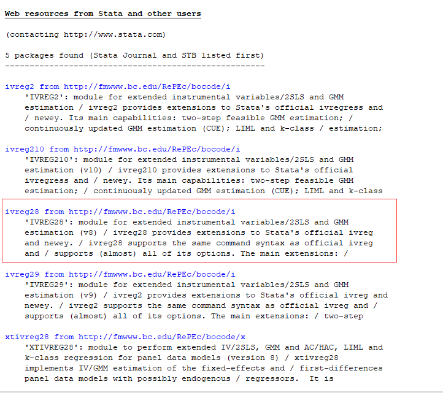

安装完后，就能用了

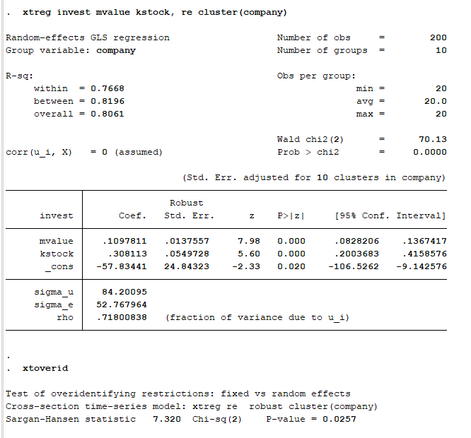

###  Mundlak’s (1978)法

mundlak 需要安装，`findit mundlak`看说明得装第三个


###  基于 bootstrap法的hausman检验

```stata
xtreg invest mvalue kstock,fe
est store fe_result
xtreg invest mvalue kstock,re
est store re_result
rhausman fe_result re_result,reps(200) cluster
```

`rhausman`没有该指令，接着安装！，`findit rhausman`，只有一个安装源，点就对了。

###  相关 Stata 命令推荐

```stata
qui xtreg invest mvalue kstock, fe
xttest2
 qui xtreg invest mvalue kstock, re
 xtcsd, pesaran
```

xtcsd指令没有，后面两个都可以，我选的第三个。

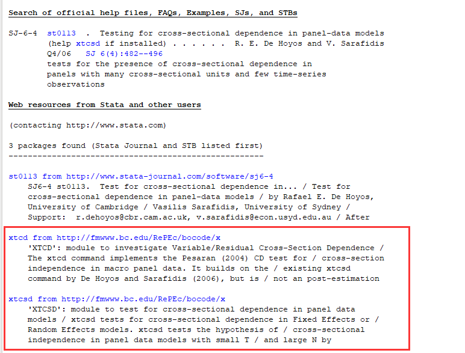