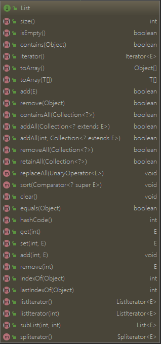
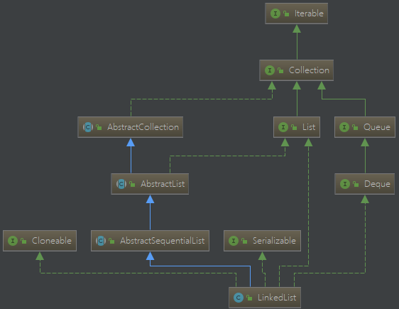

> List ArrayList 源码阅读

<!-- more -->

​                        ==== 

## List

### sort

> 排序方法，先转换为数组，使用Arrays.sort() 进行排序。一般通过匿名内部类传入比较器，排序完成后，通过迭代器完成赋值。

```java
default void sort(Comparator<? super E> c) {
    Object[] a = this.toArray();
    Arrays.sort(a, (Comparator) c);
    ListIterator<E> i = this.listIterator();
    for (Object e : a) {
        i.next();
        i.set((E) e);
    }
}
```

## ArrayList


### 成员变量

```java
// 默认容量， 10 
private static final int DEFAULT_CAPACITY = 10;
// 空数组实例
 private static final Object[] EMPTY_ELEMENTDATA = {};
// DEFAULTCAPACITY_EMPTY_ELEMENTDATA 与 EMPTY_ELEMENTDATA 区别在于初始化不同，可以在构造方法中得到答案
private static final Object[] DEFAULTCAPACITY_EMPTY_ELEMENTDATA = {};
// 数组最大的长度，有些虚拟机在数组中有保存头部信息，因而分配过大的内存，会导致 OutOfMemoryError 错误
private static final int MAX_ARRAY_SIZE = Integer.MAX_VALUE - 8;
```

### 构造方法

> 从构造方法中可以看大，elementData = EMPTY_ELEMENTDATA 的情况都是 initialCapacity 值已知的情况。而  elementData = DEFAULTCAPACITY_EMPTY_ELEMENTDATA 时，对 initialCapacity 未做处理，相当于一种特殊的标记。这个和类的设计者想法有关，只能说这个标记方法比较秀。

```java
public ArrayList(int initialCapacity) {
    if (initialCapacity > 0) {
        this.elementData = new Object[initialCapacity];
    } else if (initialCapacity == 0) {
        this.elementData = EMPTY_ELEMENTDATA;
    } else {
        throw new IllegalArgumentException("Illegal Capacity: "+
                                           initialCapacity);
    }
}
public ArrayList() {
    this.elementData = DEFAULTCAPACITY_EMPTY_ELEMENTDATA;
}
public ArrayList(Collection<? extends E> c) {
    elementData = c.toArray();
    if ((size = elementData.length) != 0) {
        // c.toArray might (incorrectly) not return Object[] (see 6260652)
        if (elementData.getClass() != Object[].class)
            elementData = Arrays.copyOf(elementData, size, Object[].class);
    } else {
        // replace with empty array.
        this.elementData = EMPTY_ELEMENTDATA;
    }
}
```

### trimToSize

> 用于压缩，将多余的空元素去除
> 新建长度为size 的数组，并将前size个元素复制，然后替换引用。

```java
public void trimToSize() {
    modCount++;
    if (size < elementData.length) {
        elementData = (size == 0)
          ? EMPTY_ELEMENTDATA
          : Arrays.copyOf(elementData, size);
    }
}
```

### ensureCapacity -> grow

> ensureCapacity : 用做扩容，

```java
public void ensureCapacity(int minCapacity) {
    // 如果 elementData 不是 DEFAULTCAPACITY_EMPTY_ELEMENTDATA，说明已经对 容量大小进行了初始化
    // 否则，minExpand 取值为默认值 DEFAULT_CAPACITY 10
    int minExpand = (elementData != DEFAULTCAPACITY_EMPTY_ELEMENTDATA)? 0: DEFAULT_CAPACITY;
	// 若输入大小大于 minExpand,进行扩容操作
    if (minCapacity > minExpand) {
        ensureExplicitCapacity(minCapacity);
    }
}
private void ensureCapacityInternal(int minCapacity) {
    if (elementData == DEFAULTCAPACITY_EMPTY_ELEMENTDATA) {
        // 初始化，选择DEFAULT_CAPACITY 与 minCapacity 的更大值
        minCapacity = Math.max(DEFAULT_CAPACITY, minCapacity);
    }
  // 保证容量大小合适，避免扩容完没有空位添加值，
    ensureExplicitCapacity(minCapacity);
}

private void ensureExplicitCapacity(int minCapacity) {
    modCount++;

    // overflow-conscious code 避免溢出
    if (minCapacity - elementData.length > 0)
        grow(minCapacity); // 一般情况下，扩容为乘以 1.5 倍
}
private void grow(int minCapacity) {
    // overflow-conscious code
    int oldCapacity = elementData.length;
    // 新的容量是旧的容量的 1.5 倍
    int newCapacity = oldCapacity + (oldCapacity >> 1);
    if (newCapacity - minCapacity < 0)// 避免溢出
        newCapacity = minCapacity;
    if (newCapacity - MAX_ARRAY_SIZE > 0) // 避免超过最大值
        newCapacity = hugeCapacity(minCapacity);
    // minCapacity is usually close to size, so this is a win:
    elementData = Arrays.copyOf(elementData, newCapacity);
}
private static int hugeCapacity(int minCapacity) {
    if (minCapacity < 0) // overflow 
        throw new OutOfMemoryError();
    return (minCapacity > MAX_ARRAY_SIZE) ? Integer.MAX_VALUE : MAX_ARRAY_SIZE;
}
```

### indexOf / contains

> 使用 indexOf 遍历查找对应的值，如果存在返回对应的索引，否则返回 -1
>
> contains 如果能找到，说明存在，即返回的索引位置大于-1，说明存在

```java
public boolean contains(Object o) {
    return indexOf(o) >= 0;
}

public int indexOf(Object o) {
    if (o == null) {
        for (int i = 0; i < size; i++)
            if (elementData[i]==null)
                return i;
    } else {
        for (int i = 0; i < size; i++)
            if (o.equals(elementData[i]))
                return i;
    }
    return -1;
}
```

### lastIndexOf

> 功能和函数名一致，从后往前遍历，查找对应的值，并返回索引位置，若没找到返回 -1

```java
public int lastIndexOf(Object o) {
    if (o == null) {
        for (int i = size-1; i >= 0; i--)
            if (elementData[i]==null)
                return i;
    } else {
        for (int i = size-1; i >= 0; i--)
            if (o.equals(elementData[i]))
                return i;
    }
    return -1;
}
```

### clone

```java
public Object clone() {
    try {
        ArrayList<?> v = (ArrayList<?>) super.clone();
        v.elementData = Arrays.copyOf(elementData, size); // 如果数组中的数据是基础类型，那么是深拷贝；若是引用类型，则浅拷贝
        v.modCount = 0;
        return v;
    } catch (CloneNotSupportedException e) {
        // this shouldn't happen, since we are Cloneable
        throw new InternalError(e);
    }
}
```

### toArray

> 提供两种方法，一种无参，会根据数据个数自动新建一个数组，并复制所有数据，然后返回。
> 第二种，使用数组作为参数传入，如果传入数组长度小于数据长度，将新建数组返回；如果长度大于等于数据长度，则将所有数据复制到传入数组中。

```java
public Object[] toArray() {
    return Arrays.copyOf(elementData, size);
}
public <T> T[] toArray(T[] a) {
    if (a.length < size)
        // Make a new array of a's runtime type, but my contents:
        return (T[]) Arrays.copyOf(elementData, size, a.getClass());
    System.arraycopy(elementData, 0, a, 0, size);
    if (a.length > size)
        a[size] = null;
    return a;
}
public static <T> T[] copyOf(T[] original, int newLength) {
    return (T[]) copyOf(original, newLength, original.getClass());
}
public static <T,U> T[] copyOf(U[] original, int newLength, Class<? extends T[]> newType) {
    @SuppressWarnings("unchecked")
    // 根据类型新建的数组，故而与List中原数据是独立的，不会因为修改而相互影响
    T[] copy = ((Object)newType == (Object)Object[].class)
        ? (T[]) new Object[newLength]
        : (T[]) Array.newInstance(newType.getComponentType(), newLength);    
    System.arraycopy(original, 0, copy, 0,
                     Math.min(original.length, newLength));
    return copy;
}
```

### get / ElementData

> ArrayList 底层使用数组实现，所有的操作都是基于数组实现
> get 方法的实质即从 elementData 中指定下标获取数据

```java
public E get(int index) {
    rangeCheck(index);
    return elementData(index);
}
E elementData(int index) {
    return (E) elementData[index];
}
```

### set

> 指定位置修改数据，即指定数组索引位置修改值；这是 ArrayList 优于 LinkedList 的地方，修改和查找方便

```java
public E set(int index, E element) {
    rangeCheck(index);
    E oldValue = elementData(index);
    elementData[index] = element;
    return oldValue;
}
```

### add

> 每次添加前确保不会越界就行。
> 有两种形式，一种不指定位置添加，默认在已有数据后添加
> 指定位置添加，如果要**经常插入，建议使用 LinkedList**，因为链表是适合插入。
> 指定位置插入步骤为：
>
> + 先将 index 后的所有数据，整体向后搬移
> + 对 index 位置进行赋值 

```java
public boolean add(E e) {
    ensureCapacityInternal(size + 1);  // Increments modCount!!
    elementData[size++] = e;
    return true;
}
public void add(int index, E element) {
    rangeCheckForAdd(index);

    ensureCapacityInternal(size + 1);  // Increments modCount!!
    System.arraycopy(elementData, index, elementData, index + 1, size - index);
    elementData[index] = element;
    size++;
}
```

### remove

> 如果参数为，int；删除指定位置的元素
> 如果传入为引用类型，则比较值进行删除；因而如果要删除 int 类型的值，可以在数字前添加 Object 进行强转
> 对于数组来说，删除后需要整体搬移后面的所有值，代价比较大；如修改大于查询，更建议使用 LinkedList

```java
public E remove(int index) {
    rangeCheck(index);

    modCount++;
    E oldValue = elementData(index);

    int numMoved = size - index - 1;
    if (numMoved > 0)
        System.arraycopy(elementData, index+1, elementData, index,
                         numMoved);
    elementData[--size] = null; // clear to let GC do its work

    return oldValue;
}
public boolean remove(Object o) {
    // 先通过遍历找到对应的 index
    if (o == null) {
        for (int index = 0; index < size; index++)
            if (elementData[index] == null) {
                fastRemove(index);
                return true;
            }
    } else {
        for (int index = 0; index < size; index++)
            if (o.equals(elementData[index])) {
                fastRemove(index);
                return true;
            }
    }
    return false;
}
// fastRemove 和 remove 效果是一样的，只不过前者有返回值，后者没有。
private void fastRemove(int index) {
    modCount++;
    int numMoved = size - index - 1;
    if (numMoved > 0)
        System.arraycopy(elementData, index+1, elementData, index,
                         numMoved);
    elementData[--size] = null; // clear to let GC do its work
}
```

### clear

> 遍历数组，并全修改为 null，size 置0

```java
public void clear() {
    modCount++;

    // clear to let GC do its work
    for (int i = 0; i < size; i++)
        elementData[i] = null;

    size = 0;
}
```

### addAll

> 类似add 方法，可以选择是否指定位置插入

```java
public boolean addAll(Collection<? extends E> c) {
    Object[] a = c.toArray();
    int numNew = a.length;
    ensureCapacityInternal(size + numNew);  // Increments modCount
    System.arraycopy(a, 0, elementData, size, numNew);
    size += numNew;
    return numNew != 0;
}
public boolean addAll(int index, Collection<? extends E> c) {
    rangeCheckForAdd(index);

    Object[] a = c.toArray();
    int numNew = a.length;
    ensureCapacityInternal(size + numNew);  // Increments modCount

    int numMoved = size - index;
    if (numMoved > 0)
        System.arraycopy(elementData, index, elementData, index + numNew,
                         numMoved);

    System.arraycopy(a, 0, elementData, index, numNew);
    size += numNew;
    return numNew != 0;
}
```

### removeRange

> 这个方法在子类中有调用，但是子类也是protected，估计是要弃用了。
> 其效用顾名思义，指定范围删除

```java
protected void removeRange(int fromIndex, int toIndex) {
    modCount++;
    int numMoved = size - toIndex;
    System.arraycopy(elementData, toIndex, elementData, fromIndex,
                     numMoved);

    // clear to let GC do its work
    int newSize = size - (toIndex-fromIndex);
    for (int i = newSize; i < size; i++) {
        elementData[i] = null;
    }
    size = newSize;
}
```

### removeAll / retainAll

> removeAll : 对两个集合做差集
> retainAll : 对两个集合做交集

```java
public boolean removeAll(Collection<?> c) {
    Objects.requireNonNull(c);
    return batchRemove(c, false);
}
public boolean retainAll(Collection<?> c) {
    Objects.requireNonNull(c);
    return batchRemove(c, true);
}
private boolean batchRemove(Collection<?> c, boolean complement) {
    final Object[] elementData = this.elementData;
    int r = 0, w = 0;
    boolean modified = false;
    try {
        for (; r < size; r++)
            if (c.contains(elementData[r]) == complement)// Set没重复值，但是List可以有
                elementData[w++] = elementData[r];
    } finally {
        // Preserve behavioral compatibility with AbstractCollection,
        // even if c.contains() throws. 避免 contains 方法抛出异常导致数据出问题
        if (r != size) { // 如果 r!= size 说明没有遍历完，contains 方法抛出过异常
            System.arraycopy(elementData, r,
                             elementData, w,
                             size - r);
            w += size - r;
        }
        if (w != size) {
            // w != size 说明操作前后 elementData 发生了改变
            /*
			做差集：如果两者元素相同 c.contains(elementData[r]) 一直为true，则后面从 0到size 全设为 null
				  如果没有交集，则 w == size; 否则，w 及 w 之前的元素才是属于差集部分，后面的都置 null
			做交集：如果没有交集，则 w == 0;完全相同则 w == size；否则 w 及 w 之前才是交集部分
            */
            // clear to let GC do its work
            for (int i = w; i < size; i++)
                elementData[i] = null;
            modCount += size - w;
            size = w;
            modified = true;
        }
    }
    return modified;
}
```

### subList

> 与 substring 不同，subList 返回的是 SubList 实例，但是其存值数组引用的原 List 中的 elementData，唯一不同的只是在取值设置的时候，额外添加了一个相对偏移量。**慎用**
> 注意：SubList 中，remove add  set 等方法都是使用的 AbstractList 中的方法，即 没有实现，如果调用了这些方法，只会得到 **UnsupportedOperationException** 异常
>
> 如果确实要获取原列表部分元素，建议这样用。

```java
List<Integer> subList = new ArrayList<>(list.subList(2, list.size()));  
List<Integer> subList = new LinkedList<>(list.subList(2, list.size()));
// ===============   或者这样用 ============================
List<Integer> subList = new ArrayList<>();  
subList.addAll(list.subList(2, list.size())); 

List<Integer> subList2 = new LinkedList<>();  
subList2.addAll(list.subList(2, list.size()));  
```

```java
// 返回的是 SubList 实例，阉割版的 ArrayList，慎用。
public List<E> subList(int fromIndex, int toIndex) {
    subListRangeCheck(fromIndex, toIndex, size);
    return new SubList(this, 0, fromIndex, toIndex);
}
```

### forEach

> Consumer 是 Java8 新增的 消费型函数式 接口
> 该方法，主要用作函数式编程用。如：
>
> ```java
> //使用com.google.guava包创建集合
> List<String> list =Lists.newArrayList("a","b","c","d");
> 
> //遍历1  其中anyThing可以用其它字符替换
> list.forEach((anyThing)->System.out.println(anyThing));
> //遍历2
> list.forEach(any->System.out.println(any));
> //匹配输出 : "b"
> list.forEach(item->{
>     if("b".equals(item)){
>         System.out.println(item);
>     }
> });
> ```

```java
public void forEach(Consumer<? super E> action) {
    Objects.requireNonNull(action);
    final int expectedModCount = modCount;
    @SuppressWarnings("unchecked")
    final E[] elementData = (E[]) this.elementData;
    final int size = this.size;
    for (int i=0; modCount == expectedModCount && i < size; i++) {
        action.accept(elementData[i]);
    }
    if (modCount != expectedModCount) {
        throw new ConcurrentModificationException();
    }
}
```

### removeIf

> Java 8 新增方法，作用是按照一定的规则过滤集合中的元素，支持 lambda 方法
>
> ```java
> // 该样例原文地址：https://blog.csdn.net/qq_33829547/article/details/80277956 
> Collection<Person> collection = new ArrayList();
> collection.add(new Person("张三", 22, "男"));
> collection.add(new Person("李四", 19, "女"));
> collection.add(new Person("王五", 34, "男"));
> collection.add(new Person("赵六", 30, "男"));
> collection.add(new Person("田七", 25, "女"));
> 
> 
> collection.removeIf(
>     person -> person.getAge() >= 30
> );//过滤30岁以上的求职者
> /*
> collection.removeIf(new Predicate<Person>() {
>     @Override
>     public boolean test(Person person) {
>         return person.getAge()>=30;//过滤30岁以上的求职者
>     }
> });
> */
> System.out.println(collection.toString());//查看结果
> ```

```java
public boolean removeIf(Predicate<? super E> filter) {
    Objects.requireNonNull(filter);
    // figure out which elements are to be removed
    // any exception thrown from the filter predicate at this stage
    // will leave the collection unmodified
    int removeCount = 0;
    //  遍历整个数组，通过 Filter判断是否满足移除条件，若满足，则记录对应的 index 
    final BitSet removeSet = new BitSet(size);
    final int expectedModCount = modCount;
    final int size = this.size;
    for (int i=0; modCount == expectedModCount && i < size; i++) {
        @SuppressWarnings("unchecked")
        final E element = (E) elementData[i];
        if (filter.test(element)) {
            removeSet.set(i);
            removeCount++;
        }
    }
    if (modCount != expectedModCount) {
        throw new ConcurrentModificationException();
    }

    // shift surviving elements left over the spaces left by removed elements
    final boolean anyToRemove = removeCount > 0;
    if (anyToRemove) {
        final int newSize = size - removeCount;
        // 挨个删除
        for (int i=0, j=0; (i < size) && (j < newSize); i++, j++) {
            i = removeSet.nextClearBit(i);// 从 i 开始查找，设定为 1的索引位置
            elementData[j] = elementData[i];
        }
        // 将余下的位置都置null， 加快gc
        for (int k=newSize; k < size; k++) {
            elementData[k] = null;  // Let gc do its work
        }
        this.size = newSize; // 对 size 重新赋值
        if (modCount != expectedModCount) {
            throw new ConcurrentModificationException();
        }
        modCount++;
    }
    return anyToRemove;
}
```

> 关于 BitSet 的源码解析可以参考 [Java1.8-BitSet源码分析](https://www.jianshu.com/p/91d75bf588b8)

### replaceAll

> UnaryOperator 继承于 Function 接口，主要用作函数式编程用
> 对所有的值都进行统一操作，如 对所有的 Integer 类型数据都加一，多所有字符串都追加一个指定字符
>
> ```java
> List<Integer> list = new ArrayList<>();
> list.add(4);
> list.add(2);
> list.add(3);
> // 将所有的 数字都加一
> list.replaceAll(t -> t + 1);
> // 也可以写成 匿名函数的方式，效果是一样的，相比 lambda 表达式，更冗长，但是对细节部分更加清晰，我这样感觉可能还是使用不够多，不习惯
> /* 
> 	list.replaceAll(new UnaryOperator<Integer>() {
>             @Override
>             public Integer apply(Integer integer) {
>                 return integer + 2;
>             }
>         });
> */
> for (int i = 0; i < list.size(); i++) {
>     System.out.println(list.get(i));
> }
> ```

```java
public void replaceAll(UnaryOperator<E> operator) {
    Objects.requireNonNull(operator);
    final int expectedModCount = modCount;
    final int size = this.size;
    for (int i=0; modCount == expectedModCount && i < size; i++) {
        elementData[i] = operator.apply((E) elementData[i]);
    }
    if (modCount != expectedModCount) {
        throw new ConcurrentModificationException();
    }
    modCount++;
}
```

### sort

> 自定义排序，一般使用匿名函数传入
> 也可使用lambda表达式 , 如Integer类型降序排序： list.sort((t1, t2) -> t2 - t1);

```java
public void sort(Comparator<? super E> c) {
    final int expectedModCount = modCount;
    Arrays.sort((E[]) elementData, 0, size, c);
    if (modCount != expectedModCount) {
        throw new ConcurrentModificationException();
    }
    modCount++;
}
```

##  Spliterator 和 Iterator

> 额外整理，这玩意儿在Java中遍地都是

## LinkedList

> LinkedList 实现了 Queue 的接口，所以 **LinkedList 可以当做队列来使用**
>
> 与 ArrayList 中区分不大的方法则不再赘述。



### 成员变量

```java
transient int size = 0; // 链表大小
transient Node<E> first; // 链表头部
transient Node<E> last; // 链表尾部
```

### 构造方法

> 相对 ArrayList，LinkedList 构造相对简单些。

```java
public LinkedList() {
}
public LinkedList(Collection<? extends E> c) {
    this();
    addAll(c);
}
```

### Node 类

> 双向链表

```java
private static class Node<E> {
    E item;
    Node<E> next;
    Node<E> prev;

    Node(Node<E> prev, E element, Node<E> next) {
        this.item = element;
        this.next = next;
        this.prev = prev;
    }
}
```

### linkFirst

> 插入节点 e， 并使节点e为头结点，即在头部插入节点e

```java
private void linkFirst(E e) {
    final Node<E> f = first;
    final Node<E> newNode = new Node<>(null, e, f);
    first = newNode;
    if (f == null) // 当前为空链表
        last = newNode;
    else
        f.prev = newNode;
    size++;
    modCount++;
}
```

### linkLast

> 与 linkLast 相反，在尾部插入

```java
void linkLast(E e) {
    final Node<E> l = last;
    final Node<E> newNode = new Node<>(l, e, null);
    last = newNode;
    if (l == null) // 当前为空链表
        first = newNode;
    else
        l.next = newNode;
    size++;
    modCount++;
}
```

### linkBefore

> 在节点 succ 之前插入节点 e，节点 succ 要求非空
> 由于链表是双向链表，因而插入比较方便

```java
void linkBefore(E e, Node<E> succ) {
    // assert succ != null;
    final Node<E> pred = succ.prev;
    final Node<E> newNode = new Node<>(pred, e, succ);// 初始化 e，初始化后，e 已单向关联前后节点
    succ.prev = newNode;
    if (pred == null)
        first = newNode; // 更新头节点
    else
        pred.next = newNode;
    size++;
    modCount++;
}
```

### toArray

> 相比 ArrayList，LinkedList转数组的实现比较 易读，遍历赋值。

```java
public Object[] toArray() {
    Object[] result = new Object[size];
    int i = 0;
    for (Node<E> x = first; x != null; x = x.next)
        result[i++] = x.item;
    return result;
}
public <T> T[] toArray(T[] a) {
    if (a.length < size)
        a = (T[])java.lang.reflect.Array.newInstance(
        a.getClass().getComponentType(), size);
    int i = 0;
    Object[] result = a;
    for (Node<E> x = first; x != null; x = x.next)
        result[i++] = x.item;

    if (a.length > size)
        a[size] = null;

    return a;
}
```

### unlinkFirst

> 删除头结点

```java
private E unlinkFirst(Node<E> f) {
    // assert f == first && f != null;
    final E element = f.item;
    final Node<E> next = f.next;
    f.item = null;
    f.next = null; // help GC
    first = next;
    if (next == null)
        last = null;
    else
        next.prev = null;
    size--;
    modCount++;
    return element;
}
```

### unlinkLast

> 删除尾节点

```java
private E unlinkLast(Node<E> l) {
    // assert l == last && l != null;
    final E element = l.item;
    final Node<E> prev = l.prev;
    l.item = null;
    l.prev = null; // help GC
    last = prev;
    if (prev == null)
        first = null;
    else
        prev.next = null;
    size--;
    modCount++;
    return element;
}
```

### unlink

> 删除指定节点

```java
E unlink(Node<E> x) {
    // assert x != null;
    final E element = x.item;
    final Node<E> next = x.next;
    final Node<E> prev = x.prev;

    if (prev == null) {
        first = next;
    } else {
        prev.next = next;
        x.prev = null;
    }

    if (next == null) {
        last = prev;
    } else {
        next.prev = prev;
        x.next = null;
    }

    x.item = null;
    size--;
    modCount++;
    return element;
}
```

### element / getFirst / getLast

> 获取首/尾节点，如果当前未空链表，则抛出 NoSuchElementException 异常

```java
public E element() {
    return getFirst();
}
public E getFirst() {
    final Node<E> f = first;
    if (f == null)
        throw new NoSuchElementException();
    return f.item;
}
public E getLast() {
final Node<E> l = last;
if (l == null)
throw new NoSuchElementException();
return l.item;
}
```

### removeFirst / removeLast

> 删除 首 / 尾 节点

```java
public E removeFirst() {
    final Node<E> f = first;
    if (f == null)
        throw new NoSuchElementException();
    return unlinkFirst(f);
}

public E removeLast() {
    final Node<E> l = last;
    if (l == null)
        throw new NoSuchElementException();
    return unlinkLast(l);
}
```

### addFirst  /  addLast / add

> 调用 linkFirst / linkLast 完成添加功能

```java
public void addFirst(E e) {
    linkFirst(e);
}

public void addLast(E e) {
    linkLast(e);
}
public void add(int index, E element) {
    checkPositionIndex(index);

    if (index == size)
        linkLast(element);
    else
        linkBefore(element, node(index));
}
```

### remove

> 移除**指定值 或 位置** 的节点，先遍历查找对应节点，再调用 unlink 进行删除
>
> 如果链表中存的是 int 类型，需额外注意。只有传入引用类型才是按值删除，否则是按位置删除

```java
public boolean remove(Object o) {
    if (o == null) {
        for (Node<E> x = first; x != null; x = x.next) {
            if (x.item == null) {
                unlink(x);
                return true;
            }
        }
    } else {
        for (Node<E> x = first; x != null; x = x.next) {
            if (o.equals(x.item)) {
                unlink(x);
                return true;
            }
        }
    }
    return false;
}
public E remove(int index) {
    checkElementIndex(index);
    return unlink(node(index));
}
```

### node

> 获取第 index 个节点
>
> 先判断 index 是否大于 当前元素总个数的一半。如果小于一半则从前面开始遍历查找，否则从后往前开始查找

```java
Node<E> node(int index) {
    // assert isElementIndex(index);

    if (index < (size >> 1)) {
        Node<E> x = first;
        for (int i = 0; i < index; i++)
            x = x.next;
        return x;
    } else {
        Node<E> x = last;
        for (int i = size - 1; i > index; i--)
            x = x.prev;
        return x;
    }
}
```

### indexOf / lastIndexOf

> 与 node方法相反，通过值确定位置，在找到值相等的节点后立即返回

```java
public int indexOf(Object o) { // 从前往后查找
    int index = 0;
    if (o == null) {
        for (Node<E> x = first; x != null; x = x.next) {
            if (x.item == null)
                return index;
            index++;
        }
    } else {
        for (Node<E> x = first; x != null; x = x.next) {
            if (o.equals(x.item))
                return index;
            index++;
        }
    }
    return -1;
}
public int lastIndexOf(Object o) {// 从后往前查找
    int index = size;
    if (o == null) {
        for (Node<E> x = last; x != null; x = x.prev) {
            index--;
            if (x.item == null)
                return index;
        }
    } else {
        for (Node<E> x = last; x != null; x = x.prev) {
            index--;
            if (o.equals(x.item))
                return index;
        }
    }
    return -1;
}
```

###  addAll

> 从指定位置添加

```java
public boolean addAll(Collection<? extends E> c) {//默认在尾部后添加
    return addAll(size, c);
}
public boolean addAll(int index, Collection<? extends E> c) {
    checkPositionIndex(index);

    Object[] a = c.toArray();
    int numNew = a.length;
    if (numNew == 0)
        return false;

    Node<E> pred, succ;
    if (index == size) {
        succ = null;
        pred = last;
    } else {
        succ = node(index);// 查找指定 index 的节点
        pred = succ.prev;
    }

    for (Object o : a) { // 逐个节点添加
        @SuppressWarnings("unchecked") E e = (E) o;
        Node<E> newNode = new Node<>(pred, e, null);
        if (pred == null)
            first = newNode;
        else
            pred.next = newNode;
        pred = newNode;
    }

    if (succ == null) {// succ 为空说明是在尾部后进行添加
        last = pred;
    } else { // 连接之前位置后的链表
        pred.next = succ;
        succ.prev = pred;
    }

    size += numNew;
    modCount++;
    return true;
}
```

### clear

> 遍历删除

```java
public void clear() {
    // Clearing all of the links between nodes is "unnecessary", but:
    // - helps a generational GC if the discarded nodes inhabit
    //   more than one generation
    // - is sure to free memory even if there is a reachable Iterator
    for (Node<E> x = first; x != null; ) {
        Node<E> next = x.next;
        x.item = null;// 必须所有都置为null，否则引用继续存在，但是没法使用，造成内存泄漏
        x.next = null;
        x.prev = null;
        x = next;
    }
    first = last = null;
    size = 0;
    modCount++;
}
```

### get  /  set

> 调用 node 方法进行查找

```java
public E get(int index) {
    checkElementIndex(index);
    return node(index).item;
}

public E set(int index, E element) {
    checkElementIndex(index);
    Node<E> x = node(index);
    E oldVal = x.item;
    x.item = element;
    return oldVal;
}
```

### isElementIndex / isPositionIndex

```java
// 判断 该 index 能否获取到值
private boolean isElementIndex(int index) {
    return index >= 0 && index < size;
}
// 判断该位置能否插入值，或能否迭代
private boolean isPositionIndex(int index) {
    return index >= 0 && index <= size;
}
// 边界检查
private void checkElementIndex(int index) {
    if (!isElementIndex(index))
        throw new IndexOutOfBoundsException(outOfBoundsMsg(index));
}
// 位置检查
private void checkPositionIndex(int index) {
    if (!isPositionIndex(index))
        throw new IndexOutOfBoundsException(outOfBoundsMsg(index));
}
```

### outOfBoundsMsg

```java
private String outOfBoundsMsg(int index) {
    return "Index: "+index+", Size: "+size;
}
```

 ### peek

> Queue 中的方法，获取出口的值，但是不移除该节点

```java
public E peek() {
    final Node<E> f = first;
    return (f == null) ? null : f.item;
}
```

###  push

> 队列中的添加

```java
public void push(E e) {
    addFirst(e);
}
```

### poll / pop

> 与 peek 的不同之处在于会移除该节点(头节点)

```java
public E poll() {
    final Node<E> f = first;
    return (f == null) ? null : unlinkFirst(f);
}
public E pop() {
    return removeFirst();
}
```

### remove

> 移除头结点

```java
public E remove() {
    return removeFirst();
}
```

###  offer

> 队列中的添加节点，默认在尾部添加节点。队列为先进先出

```java
public boolean offer(E e) {
    return add(e);
}
```

### offerFirst / offerLast / add

> 双向队列的实现，在队列最前/最后添加节点

```java
public boolean offerFirst(E e) {
    addFirst(e);
    return true;
}
public boolean offerLast(E e) {
    addLast(e);
    return true;
}
```

### add / addFirst / addLast

```java
public void addFirst(E e) {
    linkFirst(e);
}
public void addLast(E e) {
    linkLast(e);
}
public boolean add(E e) {
    linkLast(e);
    return true;
}
```

### peekFirst / peekLast

> 获取头部 / 尾部 的值，但不移除节点

```java
public E peekFirst() {
    final Node<E> f = first;
    return (f == null) ? null : f.item;
 }
public E peekLast() {
    final Node<E> l = last;
    return (l == null) ? null : l.item;
}
```

### pollFirst / pollLast

> 获取头部 / 尾部 的值，同时移除节点

```java
public E pollFirst() {
    final Node<E> f = first;
    return (f == null) ? null : unlinkFirst(f);
}
public E pollLast() {
    final Node<E> l = last;
    return (l == null) ? null : unlinkLast(l);
}
```

### removeFirst / removeLast

```java
public E removeFirst() {
    final Node<E> f = first;
    if (f == null)
        throw new NoSuchElementException();
    return unlinkFirst(f);
}
public E removeLast() {
    final Node<E> l = last;
    if (l == null)
        throw new NoSuchElementException();
    return unlinkLast(l);
}
```

### LinkedList 总结

> 由于 LinkedList 同时继承了 List 和 Queue(Dequeue) 的接口，方法个数较多，但是大多功能一样，因为多个接口的功能在概念上确实有重复。LinkedList 功能比较强大。

## ArrayList 与 LinkedList 区别

> 1. ArrayList 使用数组实现，继承了数组的特点，随机访问和修改快，O(1)；但是一旦需要增加和删除，则需要大量时间复制相关值。
> 2. LinkedList 使用双链表实现，对于 新增和删除，比较占优势，但是随机查找和修改上，效率偏低，需要逐个遍历查找 O(n)
> 3. 由于数组是定长的，ArrayList 存在扩容过程，同时有长度上限；LinkedList 没有这方面担忧
> 4. LinkedList 实现了队列的功能，ArrayList 相对单一。

## Vetor

> 在实现上，基本和 ArrayList 一样，有一些不同
>
> + Vector 觉得大多数方法都加了 synchronized 锁，少数没加锁的方法，要么是仅查询，要么是只供已加锁的方法调用，即 **Vector 是线程安全的，ArrayList 线程不安全**
> + 扩容幅度不同，在没指定扩容幅度的情况下，默认扩容为原来的 2 倍，而 ArrayList 是 1.5 倍