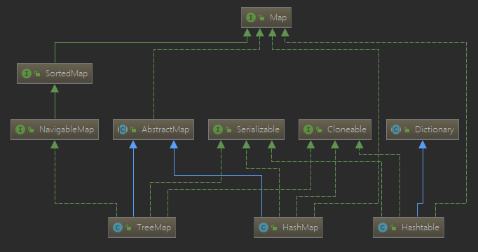
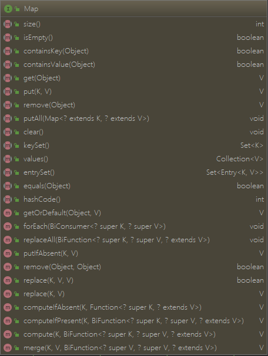
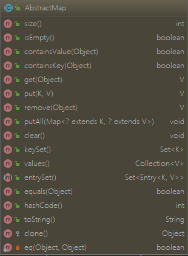

> Map 相关类 源码阅读

<!-- more -->



## Map



## AbstractMap

> 抽象类，实现了 Map接口
>
> + 抽象类不能实例化
> + 抽象类可以继承抽象类(一般不这样做)，
> + 抽象类可以实现接口，但接口中的方法可以不用实现



### size / isEmpty

```java
public int size() { // 返回 Map 包含键值对的组数
        return entrySet().size();
}
 public boolean isEmpty() { // 若当前 Map 键值对组数为 0 则返回 true，否则 false
        return size() == 0;
 }
```

### containsKey

> 遍历查找，HashMap等进行了重写

```java
 public boolean containsKey(Object key) {
     Iterator<Map.Entry<K,V>> i = entrySet().iterator();
     if (key==null) {
         while (i.hasNext()) {
             Entry<K,V> e = i.next();
             if (e.getKey()==null)
                 return true;
         }
     } else {
         while (i.hasNext()) {
             Entry<K,V> e = i.next();
             if (key.equals(e.getKey()))
                 return true;
         }
     }
     return false;
 }
```

### containsValue

> 判断 Map 中键值对的值是否包含 value，遍历查找，性能比较差。 HashMap 等进行了重写

```java
public boolean containsValue(Object value) {
    Iterator<Entry<K,V>> i = entrySet().iterator();
    if (value==null) {
        while (i.hasNext()) {
            Entry<K,V> e = i.next();
            if (e.getValue()==null)
                return true;
        }
    } else {
        while (i.hasNext()) {
            Entry<K,V> e = i.next();
            if (value.equals(e.getValue()))
                return true;
        }
    }
    return false;
}
```

### get

> 基本和前面方法的套路一样，遍历所有的值进行判断，HashMap 等进行了重写

```java
public V get(Object key) {
    Iterator<Entry<K,V>> i = entrySet().iterator();
    if (key==null) {
        while (i.hasNext()) {
            Entry<K,V> e = i.next();
            if (e.getKey()==null)
                return e.getValue();
        }
    } else {
        while (i.hasNext()) {
            Entry<K,V> e = i.next();
            if (key.equals(e.getKey()))
                return e.getValue();
        }
    }
    return null;
}
```

### put

> 未对 put 进行实现

```java
 public V put(K key, V value) {
     throw new UnsupportedOperationException();
 }
```

### remove

> 遍历查找到后删除，HashMap 等对该方法进行了重写

```java
public V remove(Object key) {
    Iterator<Entry<K,V>> i = entrySet().iterator();
    Entry<K,V> correctEntry = null;
    if (key==null) {
        while (correctEntry==null && i.hasNext()) {
            Entry<K,V> e = i.next();
            if (e.getKey()==null)
                correctEntry = e;
        }
    } else {
        while (correctEntry==null && i.hasNext()) {
            Entry<K,V> e = i.next();
            if (key.equals(e.getKey()))
                correctEntry = e;
        }
    }

    V oldValue = null;
    if (correctEntry !=null) {
        oldValue = correctEntry.getValue();
        i.remove();
    }
    return oldValue;
}
```

### putAll

> 批量添加已有 map 的元素，调用了 map 实例的 put 方法，如果实例对应的类没有实现 put 方法，则会抛出 UnsupportedOperationException 异常

```java
 public void putAll(Map<? extends K, ? extends V> m) {
         for (Map.Entry<? extends K, ? extends V> e : m.entrySet())
             put(e.getKey(), e.getValue());
 }
```

### clear

> 清除所有的元素，调用了 entrySet的方法，需要其对 clear 方法进行实现

```java
 public void clear() {
     entrySet().clear();
 }
```

### keySet

```java
transient Set<K>  keySet; // 根据已有数据生成，使用 transient 修饰，在序列化时不会保存该字段
public Set<K> keySet() {
    Set<K> ks = keySet;
    if (ks == null) { // 只有 keySet 为 null 时才会对其初始化并遍历赋值，否则直接返回。
        ks = new AbstractSet<K>() {//临时简略实现 AbstractSet，一般 HashMap等类会重新实现为内部类
            public Iterator<K> iterator() {
                return new Iterator<K>() {
                    private Iterator<Entry<K,V>> i = entrySet().iterator();

                    public boolean hasNext() {
                        return i.hasNext();
                    }

                    public K next() {
                        return i.next().getKey();
                    }

                    public void remove() {
                        i.remove();
                    }
                };
            }

            public int size() {
                return AbstractMap.this.size();
            }

            public boolean isEmpty() {
                return AbstractMap.this.isEmpty();
            }

            public void clear() {
                AbstractMap.this.clear();
            }

            public boolean contains(Object k) {
                return AbstractMap.this.containsKey(k);
            }
        };
        keySet = ks;
    }
    return ks;
}
 public abstract Set<Entry<K,V>> entrySet();
```

### values

> 与 keySet() 同理，用于返回map 中所有的 value，一般首次调用该方法时才会遍历赋值。

```java
transient Collection<V> values; 
public Collection<V> values() {
     Collection<V> vals = values;
     if (vals == null) {
         vals = new AbstractCollection<V>() { // 临时简略实现 AbstractCollection，一般 HashMap等类会重新实现为内部类
             public Iterator<V> iterator() {
                 return new Iterator<V>() {
                     private Iterator<Entry<K,V>> i = entrySet().iterator();

                     public boolean hasNext() {
                         return i.hasNext();
                     }

                     public V next() {
                         return i.next().getValue();
                     }

                     public void remove() {
                         i.remove();
                     }
                 };
             }

             public int size() {
                 return AbstractMap.this.size();
             }

             public boolean isEmpty() {
                 return AbstractMap.this.isEmpty();
             }

             public void clear() {
                 AbstractMap.this.clear();
             }

             public boolean contains(Object v) {
                 return AbstractMap.this.containsValue(v);
             }
         };
         values = vals;
     }
     return vals;
 }
```

### equals

> 重写 equals 方法 ，按如下顺序，逐级比较。
>
> 1. 判断是否指向相同内存，若相等，返回 true
> 2. 判断是否为 Map 实例，若不是，返回 false
> 3. 判断是否包含元素组数目是否相同(判断 size() 是否相等)，若不等，返回 false
> 4. 逐个值遍历比较，若存在不符合比较条件的，返回 false

```java
 public boolean equals(Object o) {
     if (o == this)
         return true;

     if (!(o instanceof Map))
         return false;
     Map<?,?> m = (Map<?,?>) o;
     if (m.size() != size())
         return false;

     try {
         Iterator<Entry<K,V>> i = entrySet().iterator();
         while (i.hasNext()) {
             Entry<K,V> e = i.next();
             K key = e.getKey();
             V value = e.getValue();
             if (value == null) {
                 if (!(m.get(key)==null && m.containsKey(key)))
                     return false;
             } else {
                 if (!value.equals(m.get(key)))
                     return false;
             }
         }
     } catch (ClassCastException unused) {
         return false;
     } catch (NullPointerException unused) {
         return false;
     }
     return true;
 }
```

### hashCode

> 所有 Entry 实例的 hashCode 相加得出的和

```java
 public int hashCode() {
     int h = 0;
     Iterator<Entry<K,V>> i = entrySet().iterator();
     while (i.hasNext())
         h += i.next().hashCode();
     return h;
 }
```

### toString

```java
public String toString() {
    Iterator<Entry<K,V>> i = entrySet().iterator();
    if (! i.hasNext())
        return "{}";

    StringBuilder sb = new StringBuilder();
    sb.append('{');
    for (;;) {
        Entry<K,V> e = i.next();
        K key = e.getKey();
        V value = e.getValue();
        sb.append(key   == this ? "(this Map)" : key);
        sb.append('=');
        sb.append(value == this ? "(this Map)" : value);
        if (! i.hasNext())
            return sb.append('}').toString();
        sb.append(',').append(' ');
    }
}
```

### clone

> 实现的是浅复制, 且为 protect 方法，典型的父类画图，子类造物。

```java
 protected Object clone() throws CloneNotSupportedException {
     AbstractMap<?,?> result = (AbstractMap<?,?>)super.clone();
     result.keySet = null;
     result.values = null;
     return result;
 }
```

### SimpleEntry 和 SimpleImmutableEntry

> AbstractMap 默认使用的 Entry 类，常用的类中，目前没找到有使用这两个类的。反正论实现肯定没有 HashMap 里面复杂靠谱。之前看过 ThreadLocalMap 比这复杂，就不详细写了。
>
> 

## HashMap

### 静态常量

```java
//  HashMap 初始化时默认大小 16，注：HashMap 的容量必须是 2 的正整数次幂
static final int DEFAULT_INITIAL_CAPACITY = 1 << 4; // aka 16
// 最大容量
static final int MAXIMUM_CAPACITY = 1 << 30;
// 默认阈值，存储元素数量达到容量的一定比例，则开始扩容，默认是0.75；在 ThreadLocalMap 中的阈值是 2/3
static final float DEFAULT_LOAD_FACTOR = 0.75f;
```

```java
/* Because TreeNodes are about twice the size of regular nodes, we
     * use them only when bins contain enough nodes to warrant use
     * (see TREEIFY_THRESHOLD). And when they become too small (due to
     * removal or resizing) they are converted back to plain bins.  In
     * usages with well-distributed user hashCodes, tree bins are
     * rarely used.  Ideally, under random hashCodes, the frequency of
     * nodes in bins follows a Poisson distribution
     * (http://en.wikipedia.org/wiki/Poisson_distribution) with a
     * parameter of about 0.5 on average for the default resizing
     * threshold of 0.75, although with a large variance because of
     * resizing granularity. Ignoring variance, the expected
     * occurrences of list size k are (exp(-0.5) * pow(0.5, k) /
     * factorial(k)). The first values are:
     *
     * 0:    0.60653066
     * 1:    0.30326533
     * 2:    0.07581633
     * 3:    0.01263606
     * 4:    0.00157952
     * 5:    0.00015795
     * 6:    0.00001316
     * 7:    0.00000094
     * 8:    0.00000006
     * more: less than 1 in ten million
     */
// 桶中链表转树结构的默认边界值，大于8 时才会转换为红黑树
static final int TREEIFY_THRESHOLD = 8;
// 如果链表长度小于 6， 那就不用树结构了，而是采用链表
static final int UNTREEIFY_THRESHOLD = 6; 
// 只有当 HashMap 中数组的长度 或 元素对个数大于 64时，才会考虑转换为红黑树。否则即使桶中链表长度大于8也不转换为树结构
static final int MIN_TREEIFY_CAPACITY = 64;
```

#### (桶中)链表转红黑树的阀值为何默认为8？

> 源码中的注释有解释，为何为8； 翻译过来大致是这样的，（我终于知道大佬们的答案从哪儿来的了......）
>
> 理想情况下，在随机哈希代码下，桶中的节点频率遵循泊松分布。由频率表可以看出，桶的长度超过8的概率非常非常小。所以根据概率统计而选择了8作为阀值。
>
> 忽略方差，列表大小k的预期出现次数为 $\frac{e^{-0.5}*0.5^{k}}{k!}$ 主要桶的个数及对应概率如下：
>
> 0: 0.60653066
> 1: 0.30326533
> 2: 0.07581633
> 3: 0.01263606
> 4: 0.00157952
> 5: 0.00015795
> 6: 0.00001316
> 7: 0.00000094
> 8: 0.00000006
> 更多: 少于百万分之一

### 构造函数 Constructors

> HashMap 的构造函数主要有四种；HashMap 的构造方法只用来初始化相关参数，只有在添加第一个元素(调用 put 方法)时，才会初始化用于存储数据的数组等变量。
> 初始化调用顺序: put--> putVal --> resize

```java
// 指定初始化的 容量 和 阈值；容量值如果输入的不是 2 的整数次幂，会自动进行转换
public HashMap(int initialCapacity, float loadFactor) {
     if (initialCapacity < 0)
         throw new IllegalArgumentException("Illegal initial capacity: " +
                                            initialCapacity);
     if (initialCapacity > MAXIMUM_CAPACITY)
         initialCapacity = MAXIMUM_CAPACITY;
     if (loadFactor <= 0 || Float.isNaN(loadFactor))
         throw new IllegalArgumentException("Illegal load factor: " +
                                            loadFactor);
     this.loadFactor = loadFactor;
     this.threshold = tableSizeFor(initialCapacity); // 将 initialCapacity 转换为相应的 2的整数次幂
 }

 public HashMap(int initialCapacity) {
     this(initialCapacity, DEFAULT_LOAD_FACTOR);
 }

public HashMap() {
    this.loadFactor = DEFAULT_LOAD_FACTOR; // all other fields defaulted
}

public HashMap(Map<? extends K, ? extends V> m) {
    this.loadFactor = DEFAULT_LOAD_FACTOR;
    putMapEntries(m, false);
}
```

