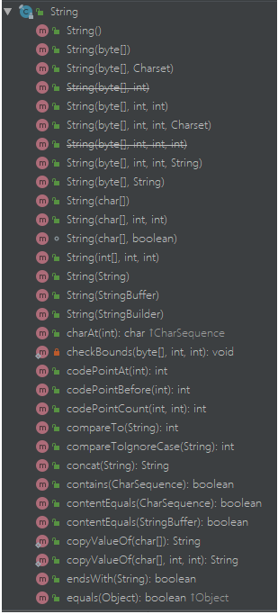
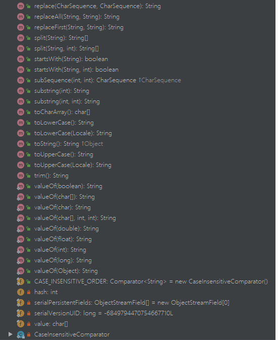

> String类源码粗读

<!-- more -->

涉及的其他类：Formatter、Character、StringJoiner、Pattern、Matcher、ArrayList等  
接口：CharSequence、Comparator等

String类包含的方法：






String是常量，其值在创建后是不可变的，StringBuffer支持可变String。  
String支持"+"连接字符串，其实际通过StringBuilder或者StringBuffer的append方法完成。  
String 完成了接口有：java.io.Serializable, Comparable<String>, CharSequence

```java
public String(char value[], int offset, int count)
```
返回从value[offset]到value[offset+count]的数组构成的长度为count的字符串，其中不包括value[offset+count]，  
其底层实现为

```java
Arrays.copyOfRange(value, offset, offset+count);
```
```java
public static long[] copyOfRange(long[] original, int from, int to) {
        int newLength = to - from;
        if (newLength < 0)
            throw new IllegalArgumentException(from + " > " + to);
        long[] copy = new long[newLength];
        System.arraycopy(original, from, copy, 0,
                         Math.min(original.length - from, newLength));
        return copy;
    }
```

```java
public String(int[] codePoints, int offset, int count)
```
输入codePoints为unicode数组  
 Character.isBmpCodePoint（int codePoint）java方法确定指定的字符（Unicode代码点）是否在Basic Multilingual Plane（BMP）中。可以使用单个char来表示这样的代码点。
```java
public String(byte ascii[], int hibyte, int offset, int count)
```
输入为AscII码，即，8-bit的整数值，  
hibyte：The top 8 bits of each 16-bit Unicode code unit

序列化和反序列化的主要业务逻辑都在ObjectOutputStream、ObjectInputStream中完成，  
ObjectStreamClass里主要存放类描述信息，ObjectStreamField存放成员变量描述信息，  
ObjectStreamConstants存放的主要是一些16进制的常量    

```java
public String(byte bytes[], int offset, int length, String charsetName)
```
将byte数组根据指定编码进行解码  
其最终调用：
```java
StringCoding.decode(charsetName, bytes, offset, length);
```
```java
public String(byte bytes[], int offset, int length, Charset charset)
StringCoding.decode(charset, bytes, offset, length);
```


```java
public String(StringBuffer buffer) {
        synchronized(buffer) {
            this.value = Arrays.copyOf(buffer.getValue(), buffer.length());
        }
    }
public String(StringBuilder builder) {
        this.value = Arrays.copyOf(builder.getValue(), builder.length());
    }
```
返回的值和原来StringBuffer、StringBuilder对象不会互相影响，是深复制。  


```java
 String(char[] value, boolean share)
```
用于内部调用，如substring，replace，concat，valueOf等，提高效率，因为传的是引用，不是深复制。**由于可能造成内存泄漏，在Java7开始不再使用该方法。**,而是使用：
```java
newString(value, beginIndex, subLen)
```
```java
String aLongString = "...averylongstring...";
String aPart = data.substring(20, 40);
return aPart;
```
在这里 aLongString 只是临时的，真正有用的是 aPart，其长度只有 20 个字符，但是它的内部数组却是从 aLongString 那里共享的，因此虽然 aLongString 本身可以被回收，但它的内部数组却不能释放。这就导致了内存泄漏。如果一个程序中这种情况经常发生有可能会导致严重的后果，如内存溢出，或性能下降。

```java
public int codePointAt(int index) {
        if ((index < 0) || (index >= value.length)) {
            throw new StringIndexOutOfBoundsException(index);
        }
        return Character.codePointAtImpl(value, index, value.length);
    }
public int offsetByCodePoints(int index, int codePointOffset) {
        if (index < 0 || index > value.length) {
            throw new IndexOutOfBoundsException();
        }
        return Character.offsetByCodePointsImpl(value, 0, value.length,
                index, codePointOffset);
    }
```
反馈类似ascii码的一个整数。

Copy characters from this string into dst starting at dstBegin.
This method doesn't perform any range checking.
```java
    void getChars(char dst[], int dstBegin) {
        System.arraycopy(value, 0, dst, dstBegin, value.length);
    }
```
Copies characters from this string into the destination character
```java
public void getChars(int srcBegin, int srcEnd, char dst[], int dstBegin) {
        if (srcBegin < 0) {
            throw new StringIndexOutOfBoundsException(srcBegin);
        }
        if (srcEnd > value.length) {
            throw new StringIndexOutOfBoundsException(srcEnd);
        }
        if (srcBegin > srcEnd) {
            throw new StringIndexOutOfBoundsException(srcEnd - srcBegin);
        }
        System.arraycopy(value, srcBegin, dst, dstBegin, srcEnd - srcBegin);
    }
```

```java
public byte[] getBytes() {
        return StringCoding.encode(value, 0, value.length);
    }
```

先比较地址，再比较是否都是String实例，再比较长度，再比较具体char
```java
public boolean equals(Object anObject) {
        if (this == anObject) {
            return true;
        }
        if (anObject instanceof String) {
            String anotherString = (String)anObject;
            int n = value.length;
            if (n == anotherString.value.length) {
                char v1[] = value;
                char v2[] = anotherString.value;
                int i = 0;
                while (n-- != 0) {
                    if (v1[i] != v2[i])
                        return false;
                    i++;
                }
                return true;
            }
        }
        return false;
    }
```

忽略大小写比较字符串
```java
public boolean equalsIgnoreCase(String anotherString) {
        return (this == anotherString) ? true
                : (anotherString != null)
                && (anotherString.value.length == value.length)
                && regionMatches(true, 0, anotherString, 0, value.length);
    }
public boolean regionMatches(boolean ignoreCase, int toffset,
            String other, int ooffset, int len) {
        char ta[] = value;
        int to = toffset;
        char pa[] = other.value;
        int po = ooffset;
        // Note: toffset, ooffset, or len might be near -1>>>1.
        if ((ooffset < 0) || (toffset < 0)
                || (toffset > (long)value.length - len)
                || (ooffset > (long)other.value.length - len)) {
            return false;
        }
        while (len-- > 0) {
            char c1 = ta[to++];
            char c2 = pa[po++];
            if (c1 == c2) {
                continue;
            }
            if (ignoreCase) {
                // If characters don't match but case may be ignored,
                // try converting both characters to uppercase.
                // If the results match, then the comparison scan should
                // continue.
                char u1 = Character.toUpperCase(c1);
                char u2 = Character.toUpperCase(c2);
                if (u1 == u2) {
                    continue;
                }
                // Unfortunately, conversion to uppercase does not work properly
                // for the Georgian alphabet, which has strange rules about case
                // conversion.  So we need to make one last check before
                // exiting.
                if (Character.toLowerCase(u1) == Character.toLowerCase(u2)) {
                    continue;
                }
            }
            return false;
        }
        return true;
    }
```


```java
public boolean startsWith(String prefix, int toffset) {
        char ta[] = value;
        int to = toffset;
        char pa[] = prefix.value;
        int po = 0;
        int pc = prefix.value.length;
        // Note: toffset might be near -1>>>1.
        if ((toffset < 0) || (toffset > value.length - pc)) {
            return false;
        }
        while (--pc >= 0) {
            if (ta[to++] != pa[po++]) {
                return false;
            }
        }
        return true;
    }
```
前缀：
```java
 public boolean startsWith(String prefix) {
        return startsWith(prefix, 0);
    }
```
后缀:
```java
public boolean endsWith(String suffix) {
        return startsWith(suffix, value.length - suffix.value.length);
    }
```

哈希值计算：
```java
public int hashCode() {
        int h = hash;
        if (h == 0 && value.length > 0) {
            char val[] = value;

            for (int i = 0; i < value.length; i++) {
                h = 31 * h + val[i];
            }
            hash = h;
        }
        return h;
    }
```

Surrogate 這個概念，不是來自 Java 語言，而是來自 Unicode 編碼方式之一 UTF-16 。具體請見： UTF-16簡而言之，Java 語言內部的字符信息是使用 UTF-16 編碼。因為，char 這個類型是 16-bit 的。它可以有65536種取值，即65536個編號，每個編號可以代表1種字符。但是，Unicode 包含的字符已經遠遠超過65536個。那，編號大於65536的，還要用 16-bit 編碼，該怎麼辦？於是，Unicode 標準制定組想出的辦法就是，從這65536個編號裏，拿出2048個，規定它們是「Surrogates」，讓它們兩個為一組，來代表編號大於65536的那些字符。更具體地，編號為 U+D800 至 U+DBFF 的規定為「High Surrogates」，共1024個。編號為 U+DC00 至 U+DFFF 的規定為「Low Surrogates」，也是1024個。它們兩兩組合出現，就又可以多表示1048576種字符。

**该解释来自知乎：**https://www.zhihu.com/question/42176549/answer/93852738

```java
private int indexOfSupplementary(int ch, int fromIndex) {
        if (Character.isValidCodePoint(ch)) {
            final char[] value = this.value;
            final char hi = Character.highSurrogate(ch);
            final char lo = Character.lowSurrogate(ch);
            final int max = value.length - 1;
            for (int i = fromIndex; i < max; i++) {
                if (value[i] == hi && value[i + 1] == lo) {
                    return i;
                }
            }
        }
        return -1;
    }
```

```java
public int lastIndexOf(int ch, int fromIndex) {
        if (ch < Character.MIN_SUPPLEMENTARY_CODE_POINT) {
            // handle most cases here (ch is a BMP code point or a
            // negative value (invalid code point))
            final char[] value = this.value;
            int i = Math.min(fromIndex, value.length - 1);
            for (; i >= 0; i--) {
                if (value[i] == ch) {
                    return i;
                }
            }
            return -1;
        } else {
            return lastIndexOfSupplementary(ch, fromIndex);
        }
    }

    /**
     * Handles (rare) calls of lastIndexOf with a supplementary character.
     */
    private int lastIndexOfSupplementary(int ch, int fromIndex) {
        if (Character.isValidCodePoint(ch)) {
            final char[] value = this.value;
            char hi = Character.highSurrogate(ch);
            char lo = Character.lowSurrogate(ch);
            int i = Math.min(fromIndex, value.length - 2);
            for (; i >= 0; i--) {
                if (value[i] == hi && value[i + 1] == lo) {
                    return i;
                }
            }
        }
        return -1;
    }
```

源字符串部分段和目标字符串的部分段作比较  
```java
static int indexOf(char[] source, int sourceOffset, int sourceCount,
            char[] target, int targetOffset, int targetCount,
            int fromIndex) {
        if (fromIndex >= sourceCount) {
            return (targetCount == 0 ? sourceCount : -1);
        }
        if (fromIndex < 0) {
            fromIndex = 0;
        }
        if (targetCount == 0) {
            return fromIndex;
        }

        char first = target[targetOffset];
        int max = sourceOffset + (sourceCount - targetCount);

        for (int i = sourceOffset + fromIndex; i <= max; i++) {
            /* Look for first character. */
            if (source[i] != first) {
                while (++i <= max && source[i] != first);
            }

            /* Found first character, now look at the rest of v2 */
            if (i <= max) {
                int j = i + 1;
                int end = j + targetCount - 1;
                for (int k = targetOffset + 1; j < end && source[j]
                        == target[k]; j++, k++);

                if (j == end) {
                    /* Found whole string. */
                    return i - sourceOffset;
                }
            }
        }
        return -1;
    }
```

与IndexOf使用了两种不同的思路
```java
static int lastIndexOf(char[] source, int sourceOffset, int sourceCount,
            char[] target, int targetOffset, int targetCount,
            int fromIndex) {
        /*
         * Check arguments; return immediately where possible. For
         * consistency, don't check for null str.
         */
        int rightIndex = sourceCount - targetCount;
        if (fromIndex < 0) {
            return -1;
        }
        if (fromIndex > rightIndex) {
            fromIndex = rightIndex;
        }
        /* Empty string always matches. */
        if (targetCount == 0) {
            return fromIndex;
        }

        int strLastIndex = targetOffset + targetCount - 1;
        char strLastChar = target[strLastIndex];
        int min = sourceOffset + targetCount - 1;
        int i = min + fromIndex;

    startSearchForLastChar:
        while (true) {
            while (i >= min && source[i] != strLastChar) {
                i--;
            }
            if (i < min) {
                return -1;
            }
            int j = i - 1;
            int start = j - (targetCount - 1);
            int k = strLastIndex - 1;

            while (j > start) {
                if (source[j--] != target[k--]) {
                    i--;
                    continue startSearchForLastChar;
                }
            }
            return start - sourceOffset + 1;
        }
    }
```

取子字符串：
```java
public String substring(int beginIndex) {
        if (beginIndex < 0) {
            throw new StringIndexOutOfBoundsException(beginIndex);
        }
        int subLen = value.length - beginIndex;
        if (subLen < 0) {
            throw new StringIndexOutOfBoundsException(subLen);
        }
        return (beginIndex == 0) ? this : new String(value, beginIndex, subLen);
    }
public String substring(int beginIndex, int endIndex) {
        if (beginIndex < 0) {
            throw new StringIndexOutOfBoundsException(beginIndex);
        }
        if (endIndex > value.length) {
            throw new StringIndexOutOfBoundsException(endIndex);
        }
        int subLen = endIndex - beginIndex;
        if (subLen < 0) {
            throw new StringIndexOutOfBoundsException(subLen);
        }
        return ((beginIndex == 0) && (endIndex == value.length)) ? this
                : new String(value, beginIndex, subLen);
    }
```
```java
public String(char value[], int offset, int count) {
        if (offset < 0) {
            throw new StringIndexOutOfBoundsException(offset);
        }
        if (count <= 0) {
            if (count < 0) {
                throw new StringIndexOutOfBoundsException(count);
            }
            if (offset <= value.length) {
                this.value = "".value;
                return;
            }
        }
        // Note: offset or count might be near -1>>>1.
        if (offset > value.length - count) {
            throw new StringIndexOutOfBoundsException(offset + count);
        }
        this.value = Arrays.copyOfRange(value, offset, offset+count);
    }
```


字符串连接：
```java
public String concat(String str) {
        int otherLen = str.length();
        if (otherLen == 0) {
            return this;
        }
        int len = value.length;
    //只会复制对应长度的数据，但是会创建len + otherLen长度的数组
        char buf[] = Arrays.copyOf(value, len + otherLen);
    //将str复制到buf从buf[len]后空间
        str.getChars(buf, len);
        return new String(buf, true);
    }
public static char[] copyOf(char[] original, int newLength) {
        char[] copy = new char[newLength];
        System.arraycopy(original, 0, copy, 0,
                         Math.min(original.length, newLength));
        return copy;
    }
void getChars(char dst[], int dstBegin) {
        System.arraycopy(value, 0, dst, dstBegin, value.length);
    }
```

```java
public String replace(char oldChar, char newChar) {
        if (oldChar != newChar) {
            int len = value.length;
            int i = -1;
            char[] val = value; /* avoid getfield opcode */
// 快速找到第一个字符所在位置，减少赋值次数，提高效率？
            while (++i < len) {
                if (val[i] == oldChar) {
                    break;
                }
            }
            if (i < len) {
                char buf[] = new char[len];
                for (int j = 0; j < i; j++) {
                    //将前面i-1个字符复制到新数组
                    buf[j] = val[j];
                }
                while (i < len) {
                    char c = val[i];
                    //此处存在赋值修改
                    buf[i] = (c == oldChar) ? newChar : c;
                    i++;
                }
                return new String(buf, true);
            }
        }
        return this;
    }
```

```java
public boolean contains(CharSequence s) {
        return indexOf(s.toString()) > -1;
    }
```

reppace,split相关的方法，最后都调用了Pattern类
```java
public boolean matches(String regex) {
        return Pattern.matches(regex, this);
    }
public String replaceFirst(String regex, String replacement) {
        return Pattern.compile(regex).matcher(this).replaceFirst(replacement);
    }
public String replaceAll(String regex, String replacement) {
        return Pattern.compile(regex).matcher(this).replaceAll(replacement);
    }
public String replace(CharSequence target, CharSequence replacement) {
        return Pattern.compile(target.toString(), Pattern.LITERAL).matcher(
                this).replaceAll(Matcher.quoteReplacement(replacement.toString()));
    }
```

String message = String.join("-", "Java", "is", "cool");
// message returned is: "Java-is-cool"
```java
public static String join(CharSequence delimiter, CharSequence... elements) {
        Objects.requireNonNull(delimiter);
        Objects.requireNonNull(elements);
        // Number of elements not likely worth Arrays.stream overhead.
        StringJoiner joiner = new StringJoiner(delimiter);
        for (CharSequence cs: elements) {
            joiner.add(cs);
        }
        return joiner.toString();
    }
public static String join(CharSequence delimiter,
            Iterable<? extends CharSequence> elements) {
        Objects.requireNonNull(delimiter);
        Objects.requireNonNull(elements);
        StringJoiner joiner = new StringJoiner(delimiter);
        for (CharSequence cs: elements) {
            joiner.add(cs);
        }
        return joiner.toString();
    }
```

toUpperCase 和 toLowerCase 都现代用了高低代理判断其他字符，然后再转换  
format 方法调用 Formatter().format(format, args)    
ValueOf 调用 new String(...) 或者 类.toString()方法  


去除前后的空格
```java
public String trim() {
        int len = value.length;
        int st = 0;
        char[] val = value;    /* avoid getfield opcode */

        while ((st < len) && (val[st] <= ' ')) {
            st++;
        }
        while ((st < len) && (val[len - 1] <= ' ')) {
            len--;
        }
        return ((st > 0) || (len < value.length)) ? substring(st, len) : this;
    }
```