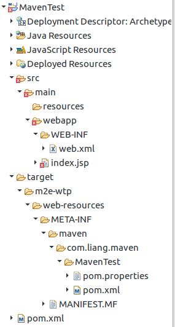
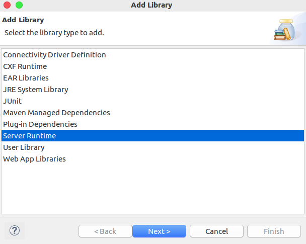
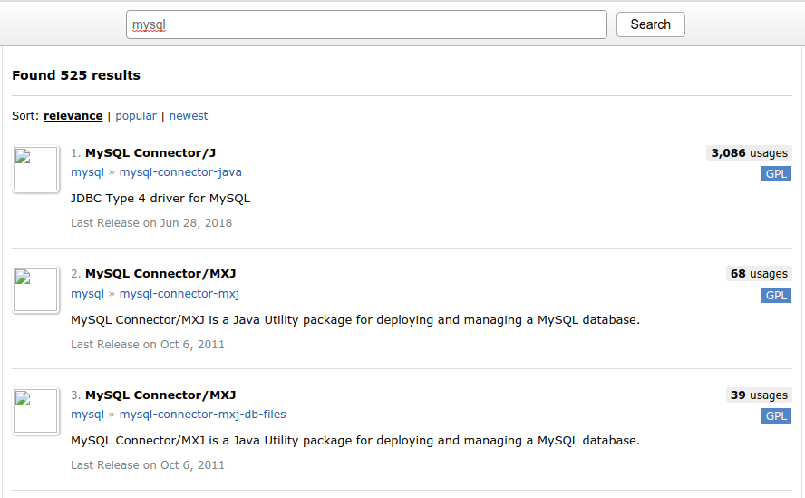
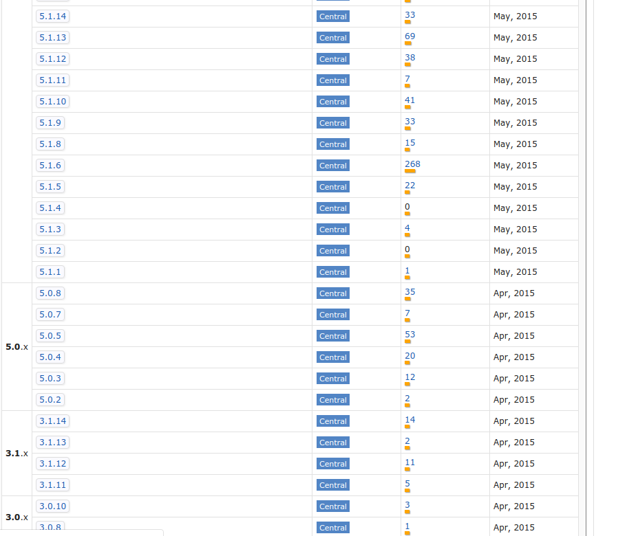
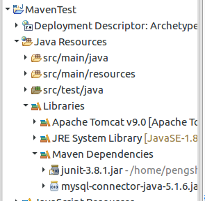

## 环境配置
### eclipse自带Maven
一般在eclipse中自带maven
通过Windows->Preference->Maven->Installations可以查看
其中EMBEDDED为自带的版本，截图如下

<!--more-->


<span style="text-align: center;color:red">图1</span>

### 使用指定版本
[官网下载链接](http://maven.apache.org/download.cgi) : http://maven.apache.org/download.cgi
对于Linux系统：

```bash
sudo mkdir /opt/maven
# 解压maven到指定目录
sudo tar zxvf apache-maven-×.×.×-bin.tar.gz -C /opt/maven
# 配置maven环境
sudo gedit /etc/profile
# 在文件内容后追加如下内容
export M2_HOME=/opt/maven/apache-maven-3.5.0
export CLASSPATH=$CLASSPATH:$M2_HOME/lib
export PATH=$PATH:$M2_HOME/bin
# 保存后使配置文件生效
source /etc/profile
# 运行以下指令以验证是否安装成功
mvn -v
# 修改maven源为阿里云及仓库存放路径，以加快下载速度
sudo gedit /opt/maven/apache-maven-3.5.0/conf/settings.xml
```
```xml
<!-- 添加或修改 标签在home目录下生成对应文件夹maven/repository -->
<localRepository>maven/repository</localRepository>
<!-- # 添加或修改 标签 以修改源 -->
<mirror>
	<id>nexus-aliyun</id>
	<mirrorOf>central</mirrorOf>
	<name>Nexus aliyun</name>
	<url>http://maven.aliyun.com/nexus/content/groups/public</url>
</mirror>
```
对于 Windows系统：
1、下载对应版本文件
2、解压到指定路径 如：D:\Program Files\Apache\maven
3、配置环境变量：
```
MAVEN_HOME:D:\Program Files\Apache\maven
# 追加到Path变量如下内容（注意前面分号问题）
%MAVEN_HOME%\bin\
# 新开cmd窗口并验证
mvn -v
# 配置D:\Program Files\Apache\maven\conf\settings.xml 同Ubuntu
```
通过点击图1 Add 按钮添加指定版本，配置安装路径即可：

<span style="text-align: center;color:red">图2</span>
至此，环境配置完成

## 新建maven项目
通过New->Project 并输入maven，到如下界面：

<span style="text-align: center;color:red">图3</span>
路径设置，一般使用默认，也可自己选择

<span style="text-align: center;color:red">图4</span>
可以使用默认的archetype，也可自行添加archetype（该操作当前不详述）

<span style="text-align: center;color:red">图5</span>
Group Id：唯一就好，个人项目随意
Artifact Id：差不多就项目名的意思

<span style="text-align: center;color:red">图6</span>
点击finish后项目路径分布如下：

<span style="text-align: center;color:red">图7</span>
右击项目选择 Build Path->Configure Build Path:

<span style="text-align: center;color:red">图8</span>
点击 Add Library，添加Server Runtime，如有需要可修改Jre System Library

<span style="text-align: center;color:red">图9</span>
点击刷新，红色叉号就消失了。
右击，运行，则在浏览器金收入  Hello World！ 页面
至此 maven项目建立完成（关于修改 maven项目名，webapp版本暂不详述）
## 下载jar包
在** 图7 **中可以看到 ** pom.xml **
通过修改该文件并保存，maven会自动下载或添加对应jar包
其初始内容如下：
```xml
<project xmlns="http://maven.apache.org/POM/4.0.0" xmlns:xsi="http://www.w3.org/2001/XMLSchema-instance"
  xsi:schemaLocation="http://maven.apache.org/POM/4.0.0 http://maven.apache.org/maven-v4_0_0.xsd">
  <modelVersion>4.0.0</modelVersion>
  <groupId>com.liang.maven</groupId>
  <artifactId>MavenTest</artifactId>
  <packaging>war</packaging>
  <version>0.0.1-SNAPSHOT</version>
  <name>MavenTest Maven Webapp</name>
  <url>http://maven.apache.org</url>
  <dependencies>
    <dependency>
      <groupId>junit</groupId>
      <artifactId>junit</artifactId>
      <version>3.8.1</version>
      <scope>test</scope>
    </dependency>
  </dependencies>
  <build>
    <finalName>MavenTest</finalName>
  </build>
</project>
```
百度输入，maven进入其[依赖查询官网](https://mvnrepository.com/) : https://mvnrepository.com/

搜索 如：mysql 并在结果中点击第一个链接：

<span style="text-align: center;color:red">图10</span>
点击后会进入版本选择页面，一般我选择使用人数最多的版本，如5.1.6

<span style="text-align: center;color:red">图11</span>
点击对应版本链接后，会进入如下页面：

<span style="text-align: center;color:red">图12</span>
将图中如下内容复制粘贴到** pom.xml **中的 **dependencies** 标签内：
```xml
<!-- https://mvnrepository.com/artifact/mysql/mysql-connector-java -->
<dependency>
    <groupId>mysql</groupId>
    <artifactId>mysql-connector-java</artifactId>
    <version>5.1.6</version>
</dependency>
```
粘贴后，pom.xml 内容如下：
```xml
<project xmlns="http://maven.apache.org/POM/4.0.0"
	xmlns:xsi="http://www.w3.org/2001/XMLSchema-instance"
	xsi:schemaLocation="http://maven.apache.org/POM/4.0.0 http://maven.apache.org/maven-v4_0_0.xsd">
	<modelVersion>4.0.0</modelVersion>
	<groupId>com.liang.maven</groupId>
	<artifactId>MavenTest</artifactId>
	<packaging>war</packaging>
	<version>0.0.1-SNAPSHOT</version>
	<name>MavenTest Maven Webapp</name>
	<url>http://maven.apache.org</url>
	<dependencies>
		<dependency>
			<groupId>junit</groupId>
			<artifactId>junit</artifactId>
			<version>3.8.1</version>
			<scope>test</scope>
		</dependency>
		<!-- https://mvnrepository.com/artifact/mysql/mysql-connector-java -->
		<dependency>
			<groupId>mysql</groupId>
			<artifactId>mysql-connector-java</artifactId>
			<version>5.1.6</version>
		</dependency>
	</dependencies>
	<build>
		<finalName>MavenTest</finalName>
	</build>
</project>
```
点击保存，并等待下载完成，下载进度在Progress中查看，下载完成后，可在项目中查看相应jar包：

<span style="text-align: center;color:red">图13</span>
在此项目基础之上，可以轻松下载想要的jar包（如果要拷贝jar包给其他人的话）

---
## Maven切换阿里云镜像源
修改 $MAVEN_HOME/conf/settings.xml
在<mirrors></mirrors>中添加至如下
```xml
  <mirrors>
    <!-- mirror
     | Specifies a repository mirror site to use instead of a given repository. The repository that
     | this mirror serves has an ID that matches the mirrorOf element of this mirror. IDs are used
     | for inheritance and direct lookup purposes, and must be unique across the set of mirrors.
     |
    <mirror>
      <id>mirrorId</id>
      <mirrorOf>repositoryId</mirrorOf>
      <name>Human Readable Name for this Mirror.</name>
      <url>http://my.repository.com/repo/path</url>
    </mirror>
     -->
	<mirror>
		 <id>AliMaven</id>
	     <mirrorOf>central</mirrorOf>
		 <name>aliyun maven</name>    
		 <url>http://maven.aliyun.com/nexus/content/groups/public/</url>
	</mirror>
  </mirrors>
```
在eclipse中 Window-->Preference-->Maven-->User Settings 将user setting或者Global Settings路径只想settings.xml,再点击apply即可。
**settings.xml可以复制到其他路径，只要eclipse设置和settings.xml路径一一对应即可**
## Maven报错
```
Failure to transferorg.apache.maven.plugins:maven-surefire-plugin:pom:
```
报类似错，找到目录 ~/.m2/repository/org/apache/maven/plugins  
将该目录下所有文件都删除，然后右击项目 Maven-->Update Project 即可
**其中 ~ 表示用户目录**