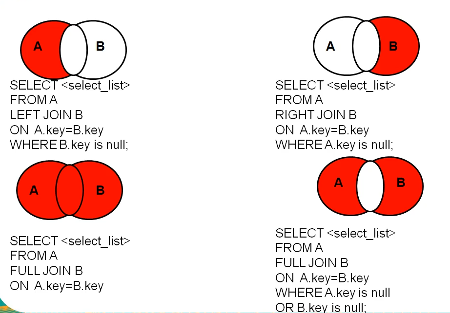
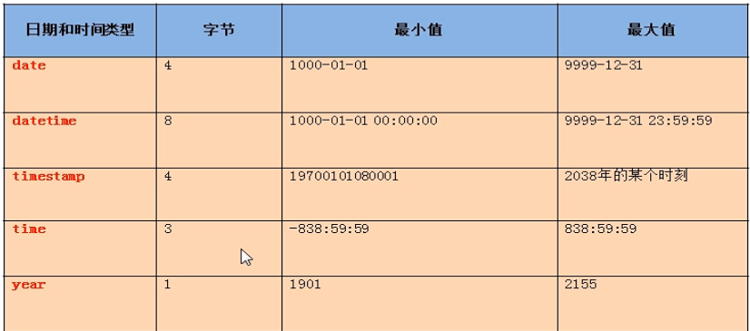

> MySQL 基础学习笔记，主要是相关查询语句、事务、存储过程与函数等。

<!-- more -->

## 一、相关基础

### 1、相关概念

DB: database，分为两类，服务端、客户端

DBMS: Database Management System

SQL: Structure Query Language

### 2、安装、环境配置等(略)

### 3、优点

+ 持久化数据
+ 结构化查询，方便管理
+ 开放源代码
+ 性能高
+ 安装、使用简单

### 4、配置文件

my.ini

> 配置服务器参数，修改后，重启服务生效。

### 5、连接

> + -h: 主机ip，需要有空格
> + -P: 端口号，需要空格
> + -u：用户名，不需空格
> + -p：密码，可明文输入，也可密文输入
>
> 本机连接时，中括号部分为可选部分

```bash
mysql [-h localhost -P 3306] -uroot -p
```

###  6、MySQL语法规范

+ 不区分大小写，建议关键字大写，表名、列名小写
+ 每条命令最好以分号结尾
+ 每条命令根据需要进行缩行、换行
+ 注释
  + 单行注释 ： # 注释文字
  + 单行注释 ： --  注释文字,--后必须有空格
  + 多行注释 ：与Java注释一致

### 7、常见命令

```mysql
# 查看数据库 databases
# 注意，自带数据库， infomation_schema,mysql, performance_schema 不能删除
show databases;
# 使用指定数据库
use test;
# 查看当前使用的数据库
select database();
# 查看数据中的表
show tables;
show tables from database_name;
# 查看表结构 describe
desc table_name;
# 查看服务器版本
select version();
# 未进入mysqlshell时
mysql --version
mysql -V
```

## 二、DQL(Data Query Language)

### 1、基础查询、条件查询

```mysql
# 对于中文，可以使用``(反引号)隔开
SELECT __cols__ FROM table_name;
# as 起别名
SELECT CONCAT(name1,name2) AS name FROM table_name;
SELECT CONCAT(name1,name2) name FROM table_name;
# 去重
SELECT DISTINCT name FROM table_name;
# + 符号的作用：仅有运算符作用，所以对列用 + 连接，会自动转换字段值并当做数值运算，若转换失败，将字符值置0处理，
# 进行数据连接时，若其中一方为null，则结果为null
# null 排除，IFNULL(null_col, value2replace),如果null_col某行为NULL，则替换为value2replace
SELECT IFNULL(nickname, ""), nickname FROM table_name;
# 条件查询，条件运算符中,不等于使用 <> ；逻辑运算符  and or not
SELECT name FROM employee WHERE NOT(age >20 AND sex="male");
```

> like 一般配合通配符使用
>
> + % 任意多个字符，包含0个字符
> + _ 任意单个字符
>
> 转义字符
>
> + \
> + 使用ESCAPE 指定转义字符

```mysql
# 模糊查询 like, between and, in, is null
SELECT name FROM employee WHERE name like '%he%';
SELECT name FROM employee WHERE name like '_$_he%' ESCAPE '$';
# 区间查找，包含区间两端值 [20,100]
SELECT name FROM employee WHERE salary BETWEEN 20 AND 100;
# 多个值选择,但是括号中的值必须相同或者兼容
SELECT name FROM empolyee WHERE name IN("Jack", "Jane", "Mars")；
# MySQL 中 =  <> 号不能判断NULL值，必须使用 IS NULL	来判断
SELECT name FROM empolyee WHERE nickname IS NULL；
SELECT name FROM empolyee WHERE nickname IS NOT NULL；
# 安全等于 <=> 安全等于功能比较好，NULL和普通值都可以比较，但是可读性不强
SELECT name FROM empolyee WHERE salary <=> 12000
SELECT name FROM empolyee WHERE nickname IS NULL；
```

### 2、排序查询

> SELECT [COLS] FROM table_name WHERE [.....] ORDER BY _order_cols [ASC|DESC]
>
> order by 可以支持单个字段、多个字段、表达式、函数、别名，一般，order by 与 limit  放在语句最后面
>
> + ASC: 升序，ascend，如果不写 默认为升序
> + DESC:降序 descend

```mysql
SELECT * FROM employee ORDER BY salary DESC
```

### 3、常用函数

#### （1）字符函数

``` MYSQL
# 字符占的字节长度
SELECT LENGTH('一个中文汉字占3个字节')
# 字符拼接
SELECT CONCAT(name1,name2) AS name FROM table_name;
# UPPER LOWER 字符大小写转换
SELECT CONCAT(UPPER(name1),LOWER(name2)) AS name FROM table_name;
# substr substring  子字符串，注意的是，索引是从1开始计数的，包左且包右，是 [] 集合
SELECT SUBSTR('一个中文汉字占3个字节', 3) `SUBSTRING` # 结果为 中文汉字占3个字节
SELECT SUBSTR('一个中文汉字占3个字节', 3, 4) `SUBSTRING` # 结果为 中文
# instr 返回子串第一次出现的素银，如果找不到返回0
SELECT INSTR('一个中文汉字占3个字节', '中文') # 结果 3
# trim 去除空格，去除指定字符
SELECT TRIM('  中文   ')   # 结果为中文
SELECT TRIM('a' from 'aaaaa中文aa英文aaa')   # 结果为  中文aa英文
# lpad  用指定字符实现左填充指定长度
SELECT LPAD('中文', 3, 'A')   # 结果为 AAA中文
# rpad  用指定字符实现右填充指定长度
SELECT RPAD('中文', 3, 'A')   # 结果为 中文AAA
# replace 替换字符
SELECT REPLACE('中文英文中文英文', '英文', '汉语')  # 结果   中文汉语中文汉语
```

#### （2）数学函数

```mysql
# round 四舍五入
SELECT ROUND(1.657)
SELECT ROUND(1.657, 2) # 保留两位小数，1.66
# ceil 向上去整, 大于等于原数值的整数
SELECT CEIL(1.657)
# floor 向下去整，小于等于原数值的整数
SELECT FLOOR(1.657)
# truncate 截断
SELECT TRUNCATE(1.657, 1) # 1.6
# mod 取余, mod(a,b)= a - a/b * b
SELECT MOD(-10, -3) # -1
SELECT -10%3 # -1
```

#### （3）日期函数

```mysql
SELECT NOW(); # 返回当前时间 2018-06-11 11:03:16
SELECT CURDATE(); # 返回当前系统日期 2018-06-11
SELECT CURTIME(); # 返回当前时间，不包含日期  11:05:14
# 获取时间的指定部分 year month day  hour minute second HOUR_MINUTE
SELECT YEAR(NOW()); 
SELECT MONTH(NOW()); 
SELECT MONTHNAME(NOW()); 
SELECT HOUR_MINUTE(NOW()); 
# 将日期格式的字符转换为指定格式的日期 STR_TO_DATE(str,format)
SELECT STR_TO_DATE('2018-6-11','%Y-%c-%d'); # 2018-06-11
# 将日期转换为指定格式 DATE_FORMAT(date,format)
SELECT DATE_FORMAT(NOW(),'%Y年%c月%d日') # 2018年6月11日
```


#### （4）其他函数

```mysql
# 版本号
select VERSION();
# 当前使用的数据库
SELECT DATABASE();
# 当前连接的用户名
SELECT USER() # root@Liang-PC
```

#### （5）流程控制函数

```mysql
# IF(expr1,expr2,expr3) 类似三元运算符
select `name` IF(salary IS NULL, '值异常', '值正常')
# case 和Java中的switch...case...效用一致，但是只用用于等值判断
SELECT `姓名`,`数学`,
CASE `数学`
	WHEN 100 THEN "满分"
	WHEN 90 THEN "合格"
	ELSE "其他"
END AS 是否及格
FROM `month_test_1`；
# 类似多重if
SELECT `姓名`,`语文`,
CASE 
	WHEN `语文`<60.0 THEN "不及格"
	WHEN `语文`>=60.0 and `语文`< 70 THEN "合格"
	WHEN `语文`>=70.0 and `语文`< 80 THEN "良好"
	ELSE "优秀"
END AS 等级
FROM `month_test_1`；
```

####  （6）分组函数

> + sum ：默认忽略null值
>
> + avg ：默认忽略null值
>
>   sum avg 参数支持类型：仅数值
>
> + max 
>
> + min 
>
> + count：默认忽略null值
>
> 分组函数可以和 distinct搭配使用
> 一般和分组函数一起查询的字段，要求是group by 后的字段

```mysql
SELECT SUM(`语文`),AVG(`语文`),MAX(`语文`),MIN(`语文`), count(`语文`)
FROM `month_test_1`；
```

> count 效率
>
> + MYISAM 存储引擎 : count(*)效率最高
>
> + INNODEB 存储引擎 : count(*)与count(1)效率差不多，比count(字段)要高

### 4、分组查询

> select 分组函数，列
> from 表
> where 条件
> group by 分组的列
> having 分组筛选条件
> order by 列
>
> **注意：**查询列一般要求和group by后的列字段一致

```mysql
SELECT count(*) as total, gname FROM `terrorismdb_zh` GROUP BY gname HAVING total>40 ORDER BY total DESC
```

### 5、连接查询

> 笛卡尔乘积现象
> 原因：没有有效的连接条件

> + 内连接 inner
>   + 等值连接
>   + 非等值连接
>   + 自连接
> + 外连接
>   + 左外连接 left join，左边的是主表
>   + 右外连接 right join，右边的是主表
>   + 全外连接 full join，= 内连接结果+表1没有但是表2有+表1有但是表2没有
> + 交叉连接 cross

```mysql
# 等值连接,注意的是，如果为表起了别名，查询字段时就不能使用原来的表名。
SELECT en.country_txt,zh.country_txt   FROM terrorismdb_en en, terrorismdb_zh zh WHERE en.eventid = zh.eventid;
# 非等值连接，相当于等于号换成非等于号关系。
# 自连接， 表与自己进行连接筛选
```
> **内外连接** 查询格式
>
> select 查询列表
> from table_1 [连接类型]
> join table_2 on 连接条件
> [where 筛选条件]
> [group by]
> [order by]

> **内连接 ** 

```mysql
# 等值连接，join可以有多个，连接多个表； 非等值连接、自连接同理
SELECT en.country_txt,zh.country_txt 
FROM terrorismdb_en en INNER JOIN terrorismdb_zh zh 
ON en.eventid = zh.eventid;
```

> **外连接**
>
> 1、外连接查询结果为主表中的所有记录，
>
> + 如果从表中没有和它匹配的，则显示null
> + 如果从表中游和它匹配的，显示匹配的值

```mysql
SELECT en.eventid, en.country_txt, zh.eventid, zh.country_txt 
FROM terrorismdb_en en LEFT OUTER JOIN terrorismdb_zh zh 
ON en.eventid = zh.eventid;
SELECT en.eventid, en.country_txt, zh.eventid, zh.country_txt 
FROM terrorismdb_en en RIGHT OUTER JOIN terrorismdb_zh zh 
ON en.eventid = zh.eventid;
# 全连接，mysql不支持
SELECT en.eventid, en.country_txt, zh.eventid, zh.country_txt 
FROM terrorismdb_en en FULL JOIN terrorismdb_zh zh 
ON en.eventid = zh.eventid;
# 改成如下等效 全连接
SELECT * FROM terrorismdb_zh zh LEFT JOIN terrorismdb_en en on zh.eventid= en.eventid
UNION
SELECT * FROM terrorismdb_zh zh RIGHT JOIN terrorismdb_en en on zh.eventid= en.eventid
```

> 交叉连接
> 笛卡尔乘积表格

```mysql
SELECT * FROM terrorismdb_zh CROSS JOIN terrorismdb_en
```




### 6、子查询

> 出现在其他语句中的select语句，称为子查询和内查询
> 内部签到其他的select语句的查询，称为外查询或主查询
>
> 特点：
>
> 1. 子查询一般放在小括号内
> 2. 子查询一般放在条件右侧
> 3. 标量子查询一般搭配单行操作符、运算符使用
> 4. 子查询优先于子查询执行
>
> 分类：
>
> 出现的位置：
> + select 后面 仅支持标量子查询
> + from 后面  支持表子查询
> + where 或 having 后面  支持标量子查询，行、列子查询
> + exists 后面 支持表子查询
>
> 结果的行列数：
> + 标量子查询 (结果集只有一行或者一列)
> + 列子查询 （结果集为一列多行）
> + 行子查询 （结果集为一行多列）
> + 表子查询 （结果集一般为多行多列）
>
> ① 单行子查询
> 	结果集只有一行
> 	一般搭配单行操作符使用：> < = <> >= <= 
> 	非法使用子查询的情况：
> 	a、子查询的结果为一组值
> 	b、子查询的结果为空

>  **非法使用子查询的情况：**
> 	a、子查询的结果为一组值
> 	b、子查询的结果为空	

> ② 多行子查询
> 	结果集有多行
> 	一般搭配多行操作符使用：any、all、in、not in
> 	in： 属于子查询结果中的任意一个就行
> 	any和all往往可以用其他查询代替

```mysql
# 标量子查询 伤亡大于某事件伤亡数的事件
SELECT * FROM terrorism_en where n_kill > (
    SELECT kill from FROM terrorism_en where eventid = 201704020001
)；
# 列子查询
SELECT * FROM terrorism_en where n_kill in (
    SELECT DISTINCT kill from FROM terrorism_en where eventid > 201704020001
)；
```

| 操作符      | 含义                                          |
| ----------- | --------------------------------------------- |
| IN/NOT IN   | 等于列表中的任意一个                          |
| ANY \| SOME | 和子查询返回的某一个值比较,IN和 =ANY 效果类似 |
| ALL         | 和子查询返回的所有值比较                      |

```mysql
# where 或 having 后面
SELECT gname,count(*) as count
FROM terrorismdb_en 
GROUP BY gname 
HAVING count >(
	SELECT count(*) FROM terrorismdb_en WHERE gname="Left-Wing Militants"
);
```

> 行子查询(比较少用)

```mysql
SELECT * 
FROM  employees
WHERE (employee_id, salary)=( # 一一对应比较筛选
	SELECT MIN(employee_id), MAX(salary)
    FROM employees
)
```

> 在from后面(将子查询结果充当一张表，要求必须起别名)

```mysql
SELECT  ag_dep.*,g.`grade_level`
FROM (
	SELECT AVG(salary) ag,department_id
	FROM employees
	GROUP BY department_id
) ag_dep
INNER JOIN job_grades g
ON ag_dep.ag BETWEEN lowest_sal AND highest_sal;
```

在 exists 后使用方法同理

### 7、分页查询

语法:

```
select 字段|表达式,...
from 表
【where 条件】
【group by 分组字段】
【having 条件】
【order by 排序的字段】
limit 【起始的条目索引】条目数;
```

说明:

> 1.起始条目索引从0开始
> 2.limit子句放在查询语句的最后
> 3.公式：select * from  表 limit （page-1）*sizePerPage,sizePerPage
> 假如:
> 每页显示条目数sizePerPage
> 要显示的页数 page

### 8、联合查询

语法：

> select 字段|常量|表达式|函数 【from 表】 【where 条件】 union 【all】
> select 字段|常量|表达式|函数 【from 表】 【where 条件】 union 【all】
> select 字段|常量|表达式|函数 【from 表】 【where 条件】 union  【all】
> .....
> select 字段|常量|表达式|函数 【from 表】 【where 条件】

说明：

> 1、多条查询语句的**查询的列数必须是一致的**
> 2、多条查询语句的查询的列的类型几乎相同
> 3、union代表去重，union all代表不去重

##  三、DDL(Data Manipulation Language)

### 1、插入

语法：
```mysql
# 方式一：支持插入多行，支持子查询
# insert into table (selct * from table2 where ......)
insert into 表名(字段名，...)
	values(值1，...)，(值2，...);
# 方式2：不支持多行
insert into 表名 set 列名=值，列名2=值2;
```


特点：

```
1、字段类型和值类型一致或兼容，而且一一对应
2、可以为空的字段，可以不用插入值，或用null填充
3、不可以为空的字段，必须插入值
4、字段个数和值的个数必须一致
5、字段可以省略，但默认所有字段，并且顺序和表中的存储顺序一致
```

```mysql
#方式一：（与方式二效果一致）
INSERT INTO my_employees
VALUES(1,'patel','Ralph','Rpatel',895),
(2,'Dancs','Betty','Bdancs',860),
(3,'Biri','Ben','Bbiri',1100),
(4,'Newman','Chad','Cnewman',750),
(5,'Ropeburn','Audrey','Aropebur',1550);
 
#方式二：
INSERT INTO my_employees
SELECT 1,'patel','Ralph','Rpatel',895 UNION
SELECT 2,'Dancs','Betty','Bdancs',860 UNION
SELECT 3,'Biri','Ben','Bbiri',1100 UNION
SELECT 4,'Newman','Chad','Cnewman',750 UNION
SELECT 5,'Ropeburn','Audrey','Aropebur',1550;
```

### 2、修改

修改单表语法：

```
update 表名 set 字段=新值,字段=新值
【where 条件】
```

修改多表语法：

```
update 表1 别名1,表2 别名2
set 字段=新值，字段=新值,......
where 连接条件
and 筛选条件
```

```mysql
update boys bo inner join beauty b on bo.id = b.boyfriend_id 
set b.phone="1245555555" where bo.boy_name = "Mike" 
```

### 3、删除

方式1：delete语句 

单表的删除： ★
	delete from 表名 【where 筛选条件】

多表的删除：
	delete 别名1，别名2
	from 表1 别名1，表2 别名2
	where 连接条件
	and 筛选条件;

方式2：truncate语句

```mysql
truncate table 表名
```

两种方式的区别【面试题】

> 1.truncate不能加where条件，而delete可以加where条件
> 2.truncate的效率高一丢丢
> 3.**truncate 删除带自增长的列的表后，如果再插入数据，数据从1开始**
> 	delete 删除带自增长列的表后，如果再插入数据，数据从上一次的断点处开始
> 4.truncate删除不能回滚，delete删除可以回滚
> 5.truncate删除没有返回值，delete有（删除了多少行）

```mysql
# sql 92
delete bo,b where bo.id = b.boyfriend_id and bo.boy_name = "Mike" 
# sql 99
delete boys bo inner join beauty b on bo.id = b.boyfriend_id where bo.boy_name = "Mike" 
```

### 4、库与表管理

+ 创建：create
+ 修改：alter
+ 删除：drop

#### （1）库管理

```mysql
# 不存在则创建, 
# 默认字符集 utf8, 使用utf8编码进行排序，ci为case insensitive 忽略大小写，utf8_general_cs区分大小写（不一定支持）
CREATE DATABASE IF NOT EXISTS database_name DEFAULT CHARACTER SET utf8 COLLATE utf8_general_ci
# 库修改（一般很少修改）
RENAME DATABASE database_name to new_name # 已弃用，不支持修改，也最好不修改
ALTER DATABASE database_name CHARACTER SET utf8
# 库删除
DROP DATABASE IF EXISTS database_name
```

#### （2）表管理

```mysql
/*
CREARE TABLE table_name(
	col1_name col1_type(col1_length),
    col2_name col2_type(col2_length),
    .......
)
*/
DROP TABLE IF EXISTS talbe_name;
CREATE TABLE IF NOT EXISTS table_name (
	`id` int(11) not null AUTO_INCREMENT,
    `name` varchar(50) not null comment "姓名",
    `age` int(4) not null comment "年龄",
    `birth` varchar(20) not null comment "出生",
    ......
    PRIMARY KEY(`id`) using BTREE
)
ENGINE=INNODB 
AUTO_INCREMENT = 1
CHARACTER SET=utf8 
COLLATE utf8_general_ci
ROW_FORMAT=Dynamic

# 表修改
ALTER TABLE table_name RENAME TO new_table_name; # 修改表名
DROP TABLE IF EXISTS talbe_name # 删除表
ALTER TABLE table_name ADD COLUMN death varchar(20); # 增加列
ALTER TABLE table_name CHANGE COLUMN birth,birth_date varchar(30); # 修改列名
ALTER TABLE table_name MODIFY COLUMN birth_date TIMESTAMP; # 修改列类型或约束
ALTER TABLE table_name DROP COLUMN death;  # 删除列
# 表复制
CREATE TABLE table_name LIKE table2copy;# 复制表结构
CREATE TABLE table_name AS SELECT col1,col2.... FROM table2copy where 1=2; # 复制表部分结构
CREATE TABLE table_name AS SELECT * FROM table2copy WHERE .....;# 复制表结构和数据(可指定行列)
```

#### （3）常见数据类型

> 数值选择类型：选择的类型越简单越好，能保存数值的类型越小越好

+ 数值型
  + 整数
    + Tinyint（1 byte）：无符号0~255，有符号 -128~127
    + Smallint（2 byte）：无符号 0~65535,有符号-32768~32767
    + Mediumint（13byte）
    + Int, integer（4 byte）
    + Bigint（8 byte）
> + 如果不设置，默认为有符号数，设置无符号数，添加unsigned关键字
> + 如果插入数值超出范围，会报 out of range 异常，并插入临界值
> + 如果不设置字段长度，会设置默认长度，尝试代表显示的最大宽度

  + 小数

> M:整数部分+小数部分 总位数
> D:小数部分 位数
> 如果超过范围，则插入临界值
> M,D可以省略，如果是Decima， M默认为10，D默认为0

  + + 定点数
> + DEC(M,D)： M+2字节，DECIMAL的简写，
> + DECIMAL(M,D)：M+2字节，通过D控制精度

+ + 浮点数

> + float(M,D)：（4 byte）
> + double(M,D)：（8byte）


+ 字符型
  + 较短文本：char  varchar
  + 较长文本：text   blob(较长的二进制文本)
  + Enum : 枚举类型，用于限定为指定值，如性别只能 “男” 或 “女”，若不在范围内，则会插入失败
  + Bit
  + binary  varbinary : 较短的二进制
  + Set ：集合类，和Enum类似
> M代表字符数
>
> char(M) : M为0~255之间，M默认为1
> varchar(M) : M为0~65535之间，M不可省略
>
> 区别：
> char  固定长度字符，效率较高，空间消耗相对大，多用于存储变化相对小的内容
> varchar 可变长度字符，效率较低，空间消耗相对小，多用于存储内容变化大的内容


+ 日期型

> 
>
> |           | 字节 |    范围     | 时区影响 |
> | :-------: | :--: | :---------: | :------: |
> | datetime  |  8   | 1000~9999年 |   不受   |
> | timestamp |  4   | 1970~2038年 |    受    |

```mysql
CREATE table IF NOT EXISTS table_name(
	t1 INT, # 有符号数
	t2 INT UNSIGNED # 无符号数
) 
CREATE table IF NOT EXISTS table_name(
	t1 INT ZEROFILL, # 有符号数,0填充，将省略的0显示出来，若0填充，默认为有符号数
	t2 INT UNSIGNED # 无符号数
) 
CREATE table IF NOT EXISTS table_name(
	sex ENUM("男", "女"), # sex 值只能为 男 或 女
) 
CREATE table IF NOT EXISTS table_name(
	group ENUM("a", "b", "c", "d"), # 插入时，可以插入多个，如 insert into table_name values("a,b,c")
) 
```

### 5、常见约束

> 用于限制表中的数据，以保证数据的准确和可靠性，一般有列级和表级约束
>
> + 列级约束：六种约束都支持，但是外键约束无效果
> + 表级约束：除了非空和默认，其他都支持

> 约束种类(6大约束)：
>
> + NOT NULL: 非空
> + DEFAULT: 默认值
> + PRIMARY KEY: 主键，值在该字段中唯一且非空
> + UNIQUE：唯一，用于保证该值在字段中唯一，可以为空；如：座位号
> + CHECK : 检查约束(mysql 不支持)
> + FOREIGN KEY ： 外键，用于限制两个表的关系，用于保证该字段的值必须来自主表关联列的值，在从表添加外键约束，用于应用主表中某列的值，如学生的专业编号，员工的部门编号等；一般在**创建或修改表**时建立外键

> 列级约束类型：直接在字段名和类型后面追加约束类型即可，只支持 默认、非空、主键、唯一四种约束
> 表级约束：在字段定义结束后，添加 [constraint 约束名] 约束类型(字段名)
>
> constraint pk primary key(id)
> constraint uq unique(seat)
> constraint ck check(gender = '男' or gender = '女')
> constraint fk_stuinfo_major foreign key(majorid) references major(id)

```mysql
CREATE TABLE table_name(
	col_name col_type  col_restriction
)
```

修改表时添加约束，在原修改表基础后面添加 约束字段即可

```mysql
# 修改列级约束，可以起到 添加、删除、修改效果
alter table 表名 modify column 字段名 字段类型 新约束
# 删除 主键
alter table 表名 drop primary key
# 删除唯一
alter table 表名 drop index index_name
# 删除外键
alter table 表名 drop foreign key key_name
# 添加表级约束
alter table 表名 add [constraint 约束名] 约束类型(字段名) [外键的引用]
```

### 6、标识列

建表时，在列后添加 AUTO_INCREMENT ,可以通过语句指定自增长的步长

注：

+ 一个表中只能有一个字段是自增长
+ 标识列的类型：只能是数值类型

```mysql
SET auto_increment_increment = 3 # 设置步长
```


## 四、TCL(Transaction Control Language)

###  1. 事务

> 一个或一组sql语句组成的一个执行单元，这个执行要么全部执行，要么全不执行

####  (1) 事务特性(ACID)

+ 原子性（Atomicity）
  原子性是指事务是一个不可分割的工作单位，事务中的操作要么都发生，要么都不发生。
+ 一致性（Consistency）
  事务前后数据的完整性必须保持一致。
+ 隔离性（Isolation）
  事务的隔离性是多个用户并发访问数据库时，数据库为每一个用户开启的事务，不能被其他事务的操作数据所干扰，多个并发事务之间要相互隔离。
+ 持久性（Durability）
  持久性是指一个事务一旦被提交，它对数据库中数据的改变就是永久性的，接下来即使数据库发生故障也不应该对其有任何影响

#### (2) 事务的创建

> 隐式事务：事务没有明显的开启和结束的标记，如 insert  update delete 语句
> 显式事务：事务具有明显的开启和结束的标记，必须先设置自动提交功能为禁用

```mysql
# 设置自动提交为0，
SET AUTOCOMMIT = 0;
START TRANSACTION; # 这一句可选
-- 事务语句 --
-- 事务语句 --
SAVEPOINT point_name # 设置保存点， 配合 ROLLBACK TO 使用
-- 事务语句 --
.......
# 提交或回滚，二选一
COMMIT # 提交事务
ROLLBACK # 回滚所有事务
ROLLBACK TO point_name # 回滚到指定的保存点
```

#### (3) 并发一致性问题

```mysql
# 包含四种级别：READ-UNCOMMITTED, READ-COMMITTED, REPEATABLE-READ, SERIALIZABLE
set session transaction isolation level serializable
```

+ 丢失修改
+ 读脏数据
+ 不可重复读
+ 幻影读

| 隔离级别 | 脏读 | 不可重复读 | 幻影读 | 加锁读 |
| :------: | :--: | :--------: | :----: | :----: |
| 未提交读 |  √   |     √      |   √    |   ×    |
|  提交读  |  ×   |     √      |   √    |   ×    |
| 可重复读 |  ×   |     ×      |   √    |   ×    |
| 可串行化 |  ×   |     ×      |   ×    |   √    |

#### delete 和 truncate 在事务中的区别

> delete 支持回滚， truncate 不支持

## 五、 视图

虚拟表，和普通表一样使用。mysql 5.1 版本出现的新特性，是通过表动态生成的数据。
注意：视图只保存 sql 逻辑，不保存查询结果，虚拟表中的数据都是根据视图定义查询动态生成的。

#### 视图创建与修改

```mysql
# 视图创建
CREATE VIEW view_name AS 
-- 查询语句 -- # 查询语句中 可以包含已有视图
# 使用视图
SELECT * FROM view_name WHERE .......
# 视图修改, 方式一
CREATE OR REPLACE VIEW view_name AS
-- 查询语句
# 视图修改， 方式二
ALTER VIEW view_name AS 
-- 查询语句
# 查看视图
DESC view_name;
SHOW CREATE VIEW view_name;
```

#### 视图更新

> 可以实现数据的插入、修改、删除，会对原始表进行修改；语法和普通SQL语句一致。

具备以下类型的视图是不能更新(有些只是 插入、修改、删除其中一项不允许)

> + 包含以下关键字的sql语句：聚合函数(sum、min、max、count)、distinct、group by 、having、union或者uinon all
>  + 常量视图
>  + select 中包含子查询
>  + join
>  + from一个不可更新的视图
>  + where字句的子查询引用了from字句中的表

```mysql
UPDATE view_name SET .... WHERE ...
DELETE view_name WHERE ....
INSERT view_name WHERE .... # 原表不涉及的字段，用默认值填充
```

视图好处：

> + 重用 sql 语句
> + 简化复杂的 sql 操作， 不必知道具体查询细节
> + 保护数据，提高安全性


## 六、变量

变量种类：

+ 系统变量
  + 全局变量
  + 会话变量
+ 自定义变量
  + 用户变量
  + 局部变量

###  系统变量

> 变量由系统提供，属于服务器层面。全局变量与会话变量的区别在于，会话变量仅仅针对当前会话(连接)有效
>
> 如果是全局变量，则需要添加 global关键词，如果是会话级别，则需要加 session 关键字，系统默认为 session，可不写

```mysql
# 查看所有的系统变量
show global | session variables;
# 查看满足条件的部分系统变量
show global | session variables like '%query_content%'
# 查看指定系统变量名，注意，在变量名前需要加一个点
select @@global | @@session .system_variable_name
# 为某个系统变量赋值
set global | session system_variable_name = new_value
set @@global | @@session .system_variable_name= new _value # 注意，在变量名前需要加一个点
```

### 自定义变量

> 针对当前会话(连接有效)，与会话变量作用域相同
> 赋值操作符为  “= ”或 “ := ”

用户变量(可存放在任何地方)

```mysql
# 声明变量并初始化
set @var_name = _value
set @var_name := _value
select @var_name := _value
# 变量赋值
select col_name into var_name from table_name # 得出的结果必须只有一个
```

局部变量

> 仅仅在定义的 begin, end 中有效
> 只能应用在 begin end 中的第一个语句

```mysql
# 变量声明
declare var_name var_type;
declare var_name var_type default var_value;
# 赋值
set @var_name = _value
set @var_name := _value
select @var_name := _value
select col_name into var_name from table_name # 得出的结果必须只有一个
# 使用  获取值
select var_name
```

## 七、存储过程和函数

### 存储过程

> 预先编译好的SQL语句的集合，类似批处理语句
>
> + 提高代码重用性
> + 简化操作
> + 减少了编译次数并减少了和数据库服务器的链接次数，提高了效率

#### 创建语法

```mysql
create procedure prd_name(param_list)
begin
	prd_body(一组合法的SQL语句)
end
# 举例
DELIMITER $
CREATE  PROCEDURE test3(IN in_name varchar(20)) BEGIN
INSERT INTO liangtest VALUES( NULL, in_name, "3" );
END $
CALL test3("liang3");# 调用
```

参数模式：

```mysql
/*
IN : 使用IN类型来传递信息，存储过程内部可以对参数的值进行修改，但是修改后的值调用者不可见。
OUT : 使用OUT类型来传递信息，在存储过程内部，该值的默认值为NULL，无论调用者是否传值给存储过程。
INOUT : 使用IN类型来传递信息，存储过程内部可以对参数的值进行修改，并将最终值返回给调用者。
*/
```

注意事项：

> 1. 如果存储过程体仅仅只有一句话，则 begin 和 end 可以胜率
> 2. 存储过程体中的每条 SQL 语句结尾要求必须加分号
> 3. 存储过程的结尾可以使用 DELIMITER 重新设置

调用

```mysql
CALL prd_name(param_list)
```

```mysql
# 举例 IN
DELIMITER $
CREATE  PROCEDURE test2(IN in_name varchar(20)) 
BEGIN
	DECLARE age INT DEFAULT 0;
	SELECT age INTO age
	FROM liangtest
	WHERE `name` = in_name;
    
    SELECT IF(age>20, '成功', '失败'); # 使用，打印结果
END $
CALL test3("liang3");# 调用
```

```mysql
# 举例 OUT
DELIMITER $
CREATE  PROCEDURE test4(IN in_name varchar(20), OUT age INT(4)) // 同理可以有多个out
BEGIN 
	SELECT age INTO age
	FROM liangtest
	WHERE `name` = in_name;
END $
-- ----------------
SET @age$
CALL test3("liang3", @age)$# 调用
```

```mysql
# 举例 INOUT
DELIMITER $
CREATE  PROCEDURE test4(INOUT a INT, INOUT B INT) 
BEGIN // 同理可以有多个out
	SET a=a*2; 
	SET b=b*2;
END $
-- ----------------
SET @m=10$
set @n=20$
CALL test3(@m,@n)$# 调用
select @m, @n;
```

#### 删除存储进程

```mysql
DROP PROCEDURE prd_name1, prd_nam2;
```

#### 查看存储过程信息

```mysql
SHOW CREATE PROCEDURE prd_name;
```

### 函数

> 函数和存储过程区别：函数有且仅有一个返回

#### 创建函数

> 参数列表包含两部分：参数名，参数类型
> 函数体：
>
> + 一定要要有 return 语句，如果没有，不会报错，但没有意义，不建议
> + 函数体中仅有一个语句时，可以省略 BEGIN, END
> + 使用 delimiter 语句设置结束标记

```mysql
CREATE FUNCTION func_name(param_list) RETURNS return_type
BEGIN
	FUNC_BODY;
END
```

```mysql
# 举例
DELIMITER $;
CREATE FUNCTION query_count() RETURNS INT
BEGIN
	DECLARE cnt INT DEFAULT 0;
	SELECT count(*) INTO cnt 
	FROM liangtest;
	RETURN cnt;
END $
# 调用
SELECT query_count() $
```

```mysql
# 举例
DELIMITER $;
CREATE FUNCTION query_count(in_name VARCHAR(20)) RETURNS INT
BEGIN
	SET @age=0;
	SELECT age INTO @age
	FROM liangtest
	WHERE `name` = in_name;
	RETURN age
END $
# 调用
SELECT query_count("liang3") $
```

#### 查看函数

```mysql
SHOW CREATE FUNCTION func_name; // 通过type字段区分 函数 和 存储过程
```

### 流程控制结构

+ 顺序结构
+ 分支结构
+ 循环结构

#### 分支结构

```mysql
/*
if函数
	语法：if(条件，值1，值2)
	特点：可以用在任何位置
case语句
特点：可以用在任何位置
*/
情况一：类似于switch
case 表达式
when 值1 then 结果1或语句1(如果是语句，需要加分号) 
when 值2 then 结果2或语句2(如果是语句，需要加分号)
...
else 结果n或语句n(如果是语句，需要加分号)
end 【case】（如果是放在begin end中需要加上case，如果放在select后面不需要）

情况二：类似于多重if
case 
when 条件1 then 结果1或语句1(如果是语句，需要加分号) 
when 条件2 then 结果2或语句2(如果是语句，需要加分号)
...
else 结果n或语句n(如果是语句，需要加分号)
end 【case】（如果是放在begin end中需要加上case，如果放在select后面不需要）
/*
if elseif 语句
特点：
	只能用在begin end中！！！！！！！！！！！！！！！
*/
if 情况1 then 语句1;
elseif 情况2 then 语句2;
...
else 语句n;
end if;
```

```mysql
/*=================   这些都可以放在函数体中    =================*/
# IF(expr1,expr2,expr3) 类似三元运算符
select `name` IF(salary IS NULL, '值异常', '值正常')
# case 和Java中的switch...case...效用一致，但是只用用于等值判断
SELECT `姓名`,`数学`,
CASE `数学`
	WHEN 100 THEN "满分"
	WHEN 90 THEN "合格"
	ELSE "其他"
END AS 是否及格
FROM `month_test_1`；
# 类似多重if
SELECT `姓名`,`语文`,
CASE 
	WHEN `语文`<60.0 THEN "不及格"
	WHEN `语文`>=60.0 and `语文`< 70 THEN "合格"
	WHEN `语文`>=70.0 and `语文`< 80 THEN "良好"
	ELSE "优秀"
END AS 等级
FROM `month_test_1`；
```


#### 循环

> 主要有 while  loop repeat

> 只能放在BEGIN END里面
>
> 如果要搭配leave跳转语句，需要使用标签，否则可以不用标签
>
> leave类似于java中的break语句，跳出所在循环

```mysql
# WHILE
[标签]: WHILE 循环条件  DO
	循环体
END WHILE [标签];

# LOOP

[标签]：LOOP
	循环体
END LOOP [标签];

# REPEAT
[标签]: REPEATE
	循环体
END REPEAT [标签];
```

> leave 语句，相当于 break
>
> iterate 语句， 相当于 continue

```mysql
TRUNCATE TABLE admin$
DROP PROCEDURE test_while1$
CREATE PROCEDURE test_while1(IN insertCount INT)
BEGIN
	DECLARE i INT DEFAULT 1;
	a:WHILE i<=insertCount DO
		INSERT INTO admin(username,`password`) VALUES(CONCAT('xiaohua',i),'0000');
		IF i>=20 THEN LEAVE a;
		END IF;
		SET i=i+1;
	END WHILE a;
END $


CALL test_while1(100)$
```

```mysql
TRUNCATE TABLE admin$
DROP PROCEDURE test_while1$
CREATE PROCEDURE test_while1(IN insertCount INT)
BEGIN
	DECLARE i INT DEFAULT 0;
	a:WHILE i<=insertCount DO
		SET i=i+1;
		IF MOD(i,2)!=0 THEN ITERATE a;
		END IF;
		
		INSERT INTO admin(username,`password`) VALUES(CONCAT('xiaohua',i),'0000');
		
	END WHILE a;
END $


CALL test_while1(100)$
```

