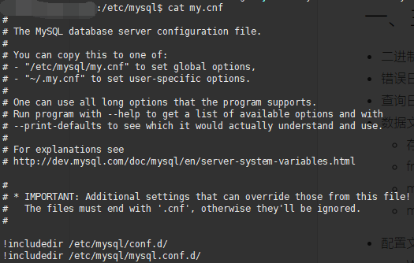

> MySQL数据库原理

<!-- more -->

## 一、主要文件

+ 二进制日志 log-bin ：可用于主从复制
+ 错误日志 log-error : 默认是关闭的，记录严重的错误和警告信息、启动和关闭等信息
+ 查询日志 log ：默认管理，记录查询的 SQL 语句，开启会降低整体性能
+ 数据文件
  + 存放路径： Windows系统在MySQL安装目录的 data 目录下，Linux系统默认路径为 /var/lib/mysql
  + frm 文件： 存放表结构
  + myd 文件：存在表数据
  + myi 文件：存放表索引
+ 配置文件
  + Windows：my.ini
  + Linux：/etc/my.cnf(在5.5版本后有所变动，如图：)



> 可见在 /etc/mysql/conf.d/ 和 /etc/msyql/mysql.conf.d/ 的 *.cnf 文件都会被读取。

## 二、存储引擎


## 三、 索引

索引类型包括：

+ 普通索引

+ 唯一索引：区别于普通索引，具有唯一性

+ 主键索引：特殊的唯一索引，不允许有空值

+ 复合索引：多个列组合在一起创建的索引

+ 外键索引：只有**InnoDB类型的表**才可以使用外键索引，保证数据的一致性、完整性和实现级联操作

+ 全文索引：MySQL 自带的全文索引只能用于 InnoDB、MyISAM ，并且只能对英文进行全文检索,一般使用全文索引引擎

  > 常用的全文索引引擎的解决方案有 Elasticsearch、Solr 等等。最为常用的是 Elasticsearch 。

### 1、索引查看与创建

```mysql
show index from table_name; # 查看表中的索引
create [unique] index idx_name on table_name(col_list); # 对指定表的相关列建立索引
drop index idx_name on table_name; # 删除索引
```
### 2、索引建立原则

+ 最适合索引的列是出现在 `WHERE` 子句中的列，或连接子句中的列，而不是出现在 `SELECT` 关键字后的列
+ 索引列的基数越大，索引效果越好，增大数据间的区分度，使索引唯一，但是更占空间，更新更耗时
+ 根据情况创建复合索引，复合索引可以提高查询效率
+ 避免创建过多的索引，索引会额外占用磁盘空间，降低写操作效率
+ 主键尽可能选择较短的数据类型，可以有效减少索引的磁盘占用提高查询效率
+ 对字符串进行索引，应该定制一个前缀长度，可以节省大量的索引空间

### 3、索引优缺点

好处：

> + 提高数据的检索速度，降低数据库IO成本：使用索引的意义就是通过缩小表中需要查询的记录的数目从而加快搜索的速度。
> + 降低数据排序的成本，降低CPU消耗：索引之所以查的快，是因为先将数据排好序，若该字段正好需要排序，则正好降低了排序的成本。

坏处：

> + 占用存储空间：索引实际上也是一张表，记录了主键与索引字段，一般以索引文件的形式存储在磁盘上。
> + 降低更新表的速度：表的数据发生了变化，对应的索引也需要一起变更，从而减低的更新速度。否则索引指向的物理数据可能不对，这也是索引失效的原因之一。

### 4、索引使用与优化

## 四、性能分析

## 参考资料

+ [MySQL索引基数](https://blog.csdn.net/mingyundezuoan/article/details/79038989)
+ [MySQL索引结构采用B+树的原因](https://my.oschina.net/edwardge/blog/1934165)