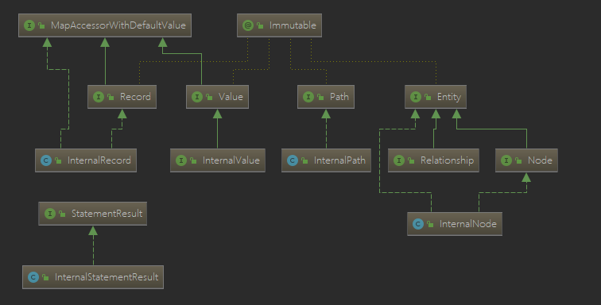
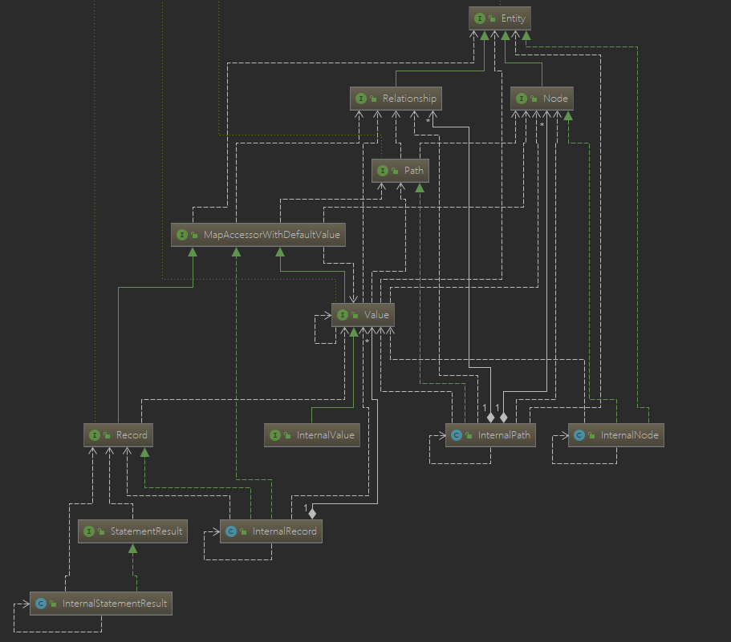
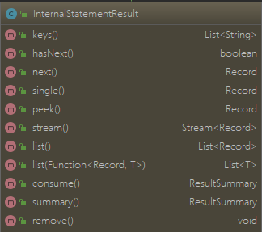

> 由于neo4j不像mysql一样有固定的字段，同时也因为neo4j不如mysql使用那么频繁，公开的工具类比较稀少。因而不得不自定义其结果返回格式。

<!-- more -->

## 一、apache的HttpClient方式请求数据(有注入风险)

> 使用Apache的HttpClient进行查询，由于查询方式是直接输入执行的cypher字符串，弄不好有注入风险，这就像mybatis中使用$ 取值有注入风险一样，至少我当前理解是这样。

> 需要使用的jar包

```xml
<dependency>
    <groupId>org.apache.httpcomponents</groupId>
    <artifactId>httpclient</artifactId>
    <version>4.5.7</version>
</dependency>
```

> 连接方式及数据返回格式选择

```java
package com.liang.neo4j;

import org.apache.http.auth.AuthScope;
import org.apache.http.auth.UsernamePasswordCredentials;
import org.apache.http.client.CredentialsProvider;
import org.apache.http.client.methods.CloseableHttpResponse;
import org.apache.http.client.methods.HttpPost;
import org.apache.http.entity.StringEntity;
import org.apache.http.impl.client.BasicCredentialsProvider;
import org.apache.http.impl.client.CloseableHttpClient;
import org.apache.http.impl.client.HttpClients;
import org.apache.http.util.EntityUtils;

import java.io.IOException;

public class HttpClientConnection {
    // 对应的连接url
    private static String url = "http://localhost:7474/db/data/transaction/commit";
    private static CredentialsProvider credsProvider = null;
    private static CloseableHttpClient httpClient = null;
    static {
        credsProvider = new BasicCredentialsProvider();
        credsProvider.setCredentials( new AuthScope("localhost", 7474),
                new UsernamePasswordCredentials("username", "passwd"));//设置对应的用户名和密码
        httpClient = HttpClients.custom().setDefaultCredentialsProvider(credsProvider).build();
    }
    	/**
	 * execute the cypher only if the cypher grammar is OK
	 * Attention: this method to access database is not suggested(at least from my perspective) since the
	 * danger of injection might occur, at the same time, the format of result is specified which means extra
	 * deal with result is almost impossible.
	 * this method executed by http post
	 * @param executeString the cypher sentence
	 * @return the string json result
	 */
    public static String httpExecute(String executeString) {
        StringEntity s = new StringEntity("{\n" +
                "  \"statements\" : [ {\n" +
                "    \"statement\" : \""+ executeString+"\"\n" +
                "  } ]\n" +
                "}","UTF-8");
        s.setContentEncoding("UTF-8");
        s.setContentType("application/json");//发送json数据需要设置contentType

        HttpPost httppost = new HttpPost(url);
        httppost.setEntity(s);
        httppost.addHeader("Content-Type", "application/json");
        httppost.addHeader("charset", "UTF-8");
        CloseableHttpResponse response = null;
        //获取结果
        String respString = "";
        try {
            response = httpClient.execute(httppost);
            // 注意，如果结果中有中文，不表明编码格式可能会乱码
            respString = EntityUtils.toString(response.getEntity(),"UTF-8");

        } catch (IOException e) {
            e.printStackTrace();
        }finally {
            try {
                if (response != null) {
                    response.close();
                }
            } catch (IOException e) {
                e.printStackTrace();
            }
        }
        return respString;

    }
    public static void main(String[] args) {
        String str = httpExecute("MATCH (n:State) RETURN n LIMIT 5");
        System.out.println(str);
    }

}
```

返回结果如下：

```json
{"results":[{"columns":["n"],"data":[{"row":[{"ChineseName":"阿肯色","name":"Arkansas","Code":"AR"}],"meta":[{"id":191954,"type":"node","deleted":false}]},{"row":[{"ChineseName":"阿拉巴马","name":"Alabama","Code":"AL"}],"meta":[{"id":191958,"type":"node","deleted":false}]},{"row":[{"ChineseName":"阿拉斯加","name":"Alaska","Code":"AK"}],"meta":[{"id":191962,"type":"node","deleted":false}]},{"row":[{"ChineseName":"爱达荷","name":"Idaho","Code":"ID"}],"meta":[{"id":191966,"type":"node","deleted":false}]},{"row":[{"ChineseName":"爱荷华","name":"Iowa","Code":"IA"}],"meta":[{"id":191979,"type":"node","deleted":false}]}]}],"errors":[]}{"results":[{"columns":["n"],"data":[{"row":[{"ChineseName":"美国","code":"USA"}],"meta":[{"id":49961,"type":"node","deleted":false}]}]}],"errors":[]}
```

## 二、使用neo4j的GraphDatabase驱动连接

> 使用到的jar包

```xml
  <!-- https://mvnrepository.com/artifact/org.neo4j.driver/neo4j-java-driver -->
<dependency>
    <groupId>org.neo4j.driver</groupId>
    <artifactId>neo4j-java-driver</artifactId>
    <version>1.7.2</version>
</dependency>
```

### 连接neo4j数据库

```java
package com.kg.database;

import org.neo4j.driver.v1.*;
import java.io.IOException;

public class Neo4jUtil {
	/**
	 * @time:2019年3月3日 下午4:53:54
	 * @description:执行对应的cypher语句并返回json形式数据
	 */	
	private static String uri="Bolt://localhost:7687";
	//后续可能要考虑添加自动关闭连接时长的设置，避免无用连接长时间保留，在config（GraphDatabase.driver可有Config参数选项）中设置
	private static Driver driver = GraphDatabase.driver(uri, AuthTokens.basic("username","passwd"));	
	/**
	 * execute cypher with value for pre-compiling which helps avoid
     * dangerous cypher injection attacks and improves database performance as
     * Neo4j can re-use query plans more often.
     * the Transaction(success, failure) is not used now 
	 * @param sentence cypher sentence
	 * @param objects params to replace sign "?" for pre-compiling
	 * @return return "succeed" when the transaction proceeded with no exception
	 */
	public static String execute(String sentence, Object... objects) {
		Value value = Values.parameters(objects);
		try (Session session = driver.session()) {
			String result = session.writeTransaction((Transaction tx)-> {
					tx.run(sentence, value);
					return "succeed";
			});
			System.out.println(result);
			session.close();
			return result;
		}
	}
	/**
	 * the run() method is as the same as the method run() in previous execute()
	 * @param sentence
	 * @param objects the params to
	 * @return
	 */
    public static StatementResult query(String sentence, Object... objects){
			StatementResult result;
			Value value = Values.parameters(objects);
			try(Session session = driver.session()){
				result = session.run(sentence, value);
			}
			return result;
	  }
	/**
	 * close the connection
	 */
    public static void close(){
        driver.close();
    }
    public static void main(String[] args) {
		StatementResult result = Neo4jUtil.query("MATCH (n:Person) RETURN n LIMIT 25");
		System.out.println(result);
		close();
	}	
}
```

### 执行cypher语句代码说明

> 如果在使用mysql数据库的时候有用过[dbutils](https://mvnrepository.com/artifact/commons-dbutils/commons-dbutils)的话，看到这样的参数注入方式还是比较亲切的。
>
> ```java
>  public static Value parameters( Object... keysAndValues )
>     {
>         if ( keysAndValues.length % 2 != 0 )
>         {
>             throw new ClientException( "Parameters function requires an even number " +
>                                        "of arguments, " +
>                                        "alternating key and value. Arguments were: " +
>                                        Arrays.toString( keysAndValues ) + "." );
>         }
>         HashMap<String,Value> map = newHashMapWithSize( keysAndValues.length / 2 );
>         for ( int i = 0; i < keysAndValues.length; i += 2 )
>         {
>             Object value = keysAndValues[i + 1];
>             assertParameter( value );
>             map.put( keysAndValues[i].toString(), value( value ) );
>         }
>         return value( map );
>     }
> ```
>
> 不过和dbutils还是有些不同的，dbutil按照顺序将需要设置的参数按照顺序建立一个数组就好，因为在mysql中，sql语句的占位符全是“?”，但是在cypher中的占位符则不同
>
> ```cypher
> MATCH (n:Student) where n.name=$name and n.age=$age return n
> MATCH (n1:Student),(n2:Student) where n1.name=$param1 and n2.name=$parm2 return n
> ```
>
> 通过查看源码不难知道，此处是通过Map来进行注入参数的。所以如果，如果在书写cql语句的时候，$符号后的参数名，如果值不是一样，务必书写成不同的单词。
>
> 实际上，也支持其他方式的生成参数,因为有如下代码，但是，我当前只用到这个（**因为[官网的demo](https://neo4j.com/developer/java/)使用Values.parameters方法**），所以，虽然知道有这些方式，但是具体怎么用，尚未来得及去探究（等哪天导师大大放我几天假，我再泡一泡这些源码）。
>
> ```java
>  public static Value value( Object value )
>     {
>         if ( value == null ) { return NullValue.NULL; }
> ...................
>         if ( value instanceof Period ) { return value( (Period) value ); }
>         if ( value instanceof Duration ) { return value( (Duration) value ); }
>         if ( value instanceof Point ) { return value( (Point) value ); }
> 
>         if ( value instanceof List<?> ) { return value( (List<Object>) value ); }
>         if ( value instanceof Map<?,?> ) { return value( (Map<String,Object>) value ); }
>         if ( value instanceof Iterable<?> ) { return value( (Iterable<Object>) value ); }
>         if ( value instanceof Iterator<?> ) { return value( (Iterator<Object>) value ); }
>         if ( value instanceof Stream<?> ) { return value( (Stream<Object>) value ); }
> ..................
> ```

## 三、自定义返回数据格式

**详细代码，看文末。**

### neo4j数据类型及关联

> 在手撕代码之前，我们有必要了解下，驱动中对结果的封装方式与依赖关系（接口实现主要在org.neo4j.driver.internal包里面）
>
> 
>
> 
>
> 大致关系是：StatementResult中包含Record(类似mysql中的行)，Record可以获取包含的Value,Value有多种可能：Node, Relationship,Path,String.所以，具体解析，要根据cypher语句中return 部分的内容。就如写msyql查询时，要根据select后的字段来书写对应的java bean。

### 各数据类型查看及解析方式 

#### 1、(Internal)StatementResult




> keys()
>
> 返回的就是 cypher语句中return 后面的内容，勉强当做列的字段名吧。
>
> hasNext()
>
> 是否有下一条数据
>
> next()
>
> 返回下一条Record，并将游标下移
>
> single()
>
> 返回结果中的第一条Record，如果结果中一条数据都没有，则抛出异常NoSuchRecordException
>
> peek()
>
> 返回下一条Record，但是游标不移动，Asynchronously investigate the next upcoming {@link Record} without moving forward in the result
>
> stream()
>
> 没用到过，以数据流返回结果？
>
> list()
>
> 以List的方式返回所有Record，以便能够多次遍历结果，不过这个方法使用时，一定得在确保数据量有限（别太多）的情况下使用，否则会造成内存不足。
>
> ```
> Note that this method can only be used if you know that the statement that
> * yielded this result returns a finite stream. Some statements can yield
> * infinite results, in which case calling this method will lead to running
> * out of memory.
> ```
>
> List<T> list( Function<Record, T> mapFunction )
>
> 自定义返回Record的方式，这个比较好玩，后面可以利用这个考虑仿照dbutils写一个工具类。其最终调用为：
>
> ```java
> List<T> result = new ArrayList<>( records.size() );
> while ( !records.isEmpty() )
> {
>     Record record = records.poll();
>     result.add( mapFunction.apply( record ) );
> }
> return result;
> ```
>
>  consume()  summary()
>
> 二者都是总结结果的情况，如运行的类型、已执行的更新的数量与类型、查询计划和分析信息等。目前没用到过，不同的是，调用前者后，所有记录都用尽，无法再使用。后者则不会。
>
> remove()
>
> emmm，这个嘛，主要接口里面有，不得不实现下。没有用也不能用的方法。因为：
>
> ```java
> @Override
> public void remove()
> {
>     throw new ClientException( "Removing records from a result is not supported." );
> }
> ```

#### 2、(Internal)Record


> ```java
> // InternalRecord 初始化时，就初始化了keys和values
> private final List<String> keys;
> private final Value[] values;
> public InternalRecord( List<String> keys, Value[] values )
> {
>     this.keys = keys;
>     this.values = values;
> }
> ```
>
> keys()
>
> 和StatementResult里面一样
>
> values()
>
> 获取Record中的所有Value，并以List返回。
>
> 返回List的长度，和cytpher语句有关
>
> ```cypher
> match (n:Student) return n limit 25 // List长度,为1，包含的为n节点
> match (n:Student),p=(n)-[r:has_friend]->() return p,n //List长度为2，第一个为p,第二个为n
> ```
>
> fields()
>
> 将Record封装，返回为List<Pair<String,Value>>,Pair有点类似Map
>
> index(String key)，containsKey(String key),get(String key),get(int index)
>
> 返回key在keys的索引,判断keys是否包含key，获取values[index(key)], 获取values[index]
>
> size()
>
> values的大小
>
> asMap(), asMap(Function<Value,T>)
>
> 返回key和vlaue的键值对，按照顺序一一对应返回。

#### 3、(Internal)Value

InternalValue依旧还是个接口，有大量类对其实现，如：PathValue，NodeValue，ListValue， StringValue，DateValue......后面所有的asXxx()方法，主要就通过这些实现类来对值进行转化。

方法太多，就不截图了，主要有以下方法：

size(), isEmpty(), keys(), get(int index), type(), hasType(Type type), isTrue(), isFalse(), isNull(), asXxx(), equals(Object), hashCode(), toString();

> size(), isEmpty(), keys(), get(int index) 略
>
> type()
>
> 求当前value的类型
>
> hasType(Type type) 
>
> 验证type是否存在Test if this value is a value of the given type
>
> ```java
> /**
>  * @return <tt>true</tt> if the value is a Boolean value and has the value True.
>  */
> boolean isTrue();
> 
> /**
>  * @return <tt>true</tt> if the value is a Boolean value and has the value False.
>  */
> boolean isFalse();
> 
> /**
>  * @return <tt>true</tt> if the value is a Null, otherwise <tt>false</tt>
>  */
> boolean isNull();
> ```
>
> 余下的asXxx()方法，不做详细介绍，主要根据返回的结果类型，进行转化

#### 4、(Internal)Node


## 四、查询结果代码

```java
package com.kg.helper;

import com.kg.database.Neo4jUtil;
import org.neo4j.driver.v1.Record;
import org.neo4j.driver.v1.StatementResult;
import org.neo4j.driver.v1.Value;
import org.neo4j.driver.v1.types.Node;
import org.neo4j.driver.v1.types.Path;
import org.neo4j.driver.v1.types.Relationship;

import java.util.*;

public class Result2Json {
    /**
     * transfer the neo4j query result to Json String
     * @param result  neo4j result
     * @return  json string transferred from result
     */
    public static String parseRelationResult(StatementResult result) {
        StringBuilder relations = new StringBuilder();
        StringBuilder nodes = new StringBuilder();
        Set nodeSet = new HashSet();
        relations.append("\"edges\":[");
        nodes.append("\"nodes\":[");
        while (result.hasNext()) {
            Record record = result.next();
            List<Value> values = record.values();
            for (Value value : values) {
                relations.append(parsePathRelation(value.asPath(), result.hasNext()));
                nodes.append(parsePathNodes(value.asPath(), result.hasNext(), nodeSet));
            }
        }
        if(nodes.charAt(nodes.length() -1) == ',')nodes.deleteCharAt(nodes.length() - 1);
        relations.append("]");
        nodes.append("]");
        System.out.println("{" + nodes.toString() + "," + relations.toString() + "}");
        return "{" + nodes.toString() + "," + relations.toString() + "}";
    }

    /**
     * transfer result which contains only nodes into json String
     * @param result result contains only nodes
     * @return json string transferred from nodes
     */
    public static String parseNodeResult(StatementResult result){
        StringBuilder nodes = new StringBuilder();
        Set nodeSet = new HashSet();
        nodes.append("[");
        while(result.hasNext()){
            Record record = result.next();
            List<Value> values = record.values();
            for(Value value : values){
                nodes.append(parseNode(value.asNode(), nodeSet));
            }
            if(result.hasNext()){
                nodes.append(",");
            }
        }
        nodes.append("]");
        return nodes.toString();
    }
    /**
     * transform the path info in the record into String
     * @param path path contained relations
     * @param hasNextResult true if the path is the last one record
     * @return relation string (json formatted) transformed from path
     */
    private static String parsePathRelation(Path path, boolean hasNextResult) {
        Iterator<Relationship> relationships = path.relationships().iterator();
        StringBuilder sb = new StringBuilder();
        while (relationships.hasNext()) {
            Relationship relationship = relationships.next();
            long startNodeId = relationship.startNodeId();
            long endNodeId = relationship.endNodeId();
            String relType = relationship.type();
            Iterator<String> relKeys = relationship.keys().iterator();
            sb.append("{\"source\":").append(startNodeId);
            sb.append(",\"target\":").append(endNodeId);
            sb.append(",\"relation\":\"").append(relType).append("\"");

            while (relKeys.hasNext()) {
                String relKey = relKeys.next();
                String relValue = relationship.get(relKey).asObject().toString();
                sb.append(",\"").append(relKey).append("\"");
                sb.append(":\"").append(formatContent(relValue)).append("\"");
            }
            if(!relationships.hasNext() && !hasNextResult){
                sb.append("}");
            } else {
                //如果是最后一个，只需要添加}即可
                sb.append("},");
            }
        }
        return sb.toString();
    }

    /**
     * transfer the node data to json string
     * Attention: remember to add the "[" & "]" for the whole json
     * add "," between each row
     * @param node data node
     * @param nodeSet set stored the nodes transferred before
     * @return json string transferred from node
     */
    private static String parseNode(Node node, Set nodeSet){
        StringBuilder sb = new StringBuilder();
        boolean isExist = nodeSet.contains(node.id());
        if(isExist)return "";
        Iterator<String> nodeProperties = node.keys().iterator();
        sb.append("{");

        while (nodeProperties.hasNext()) {
            String nodeProperty = nodeProperties.next();
            String content = node.get(nodeProperty).asObject().toString();
            sb.append("\"").append(nodeProperty).append("\"");
            if(content.startsWith("[")){
                sb.append(":").append(formatContent(content)).append(",");
            }else{
                sb.append(":\"").append(formatContent(content)).append("\",");
            }
        }
        sb.append("\"id\":");
        sb.append(node.id());
        Iterator<String> nodeTypes = node.labels().iterator();
        //添加节点类型,节点类型用的是labels，可能一个节点可以属于多个类别
        //绝大多数情况下属于一个类别！
        String nodeType = nodeTypes.next();
        sb.append(",").append("\"type\":\"");
        sb.append(nodeType).append("\"");
        sb.append("}");
        nodeSet.add(node.id());
        return sb.toString();
    }
    public static String parseNodeProperty(StatementResult result){
        StringBuilder sb = new StringBuilder();
        sb.append("[");
        while (result.hasNext()){
            Record record = result.next();
            String property = record.values().get(0).asString();
            String content = formatContent(property);
            if(result.hasNext()){
                sb.append("\"").append(content).append("\",");
            }else{
                sb.append("\"").append(content).append("\"");
            }
        }
        sb.append("]");
        return sb.toString();
    }

    /**
     * transfer the node in path to json string
     * @param path path in the record
     * @param hasNextResult true if the result has next record
     * @param nodeSet set stored the nodes transferred before
     * @return json string transferred from path
     */
    private static String parsePathNodes(Path path, boolean hasNextResult, Set nodeSet) {
        Iterator<Node> nodes = path.nodes().iterator();
        StringBuilder sb = new StringBuilder();
        while (nodes.hasNext()) {
            Node node = nodes.next();
            boolean isExist = nodeSet.contains(node.id());
            if(isExist)continue;
            sb.append(parseNode(node, nodeSet));
            //除了最后一个都需要添加逗号
            if(nodes.hasNext() || hasNextResult){
                sb.append(",");
            }
        }
        System.out.println(sb);
        return sb.toString();
    }

    /**
     * replace the special signs
     * @param content string to deal with
     * @return string dealt
     */
    private static String formatContent(String content) {
        return content.replaceAll("\t", "").replaceAll("\t", "").replaceAll("\n", "");
    }

    /**
     *
     * @param result the result return from neo4j must be like this "match (n:SecurityPerson),p=(n)-[]->() return p,n",
     *               the relation must be in front of node
     * @return
     */
    public static String parseRawRelationResult(StatementResult result) {
        Set<Node> nodeSet = new HashSet<>();
        StringBuilder nodesb = new StringBuilder();
        StringBuilder entityNamesb = new StringBuilder();
        StringBuilder resultsb = new StringBuilder();
        nodesb.append("\"nodes\":[");
        entityNamesb.append("\"entityNames\":[");
        List<Path> relationshipList = new ArrayList<>();
        while(result.hasNext()){
            Record record = result.next();
            List<Value> values = record.values();
            System.out.println("===size:===" + values.size());
            nodeSet.add(values.get(1).asNode());// whenever what it add, it'll never exist repeated node
            relationshipList.add(values.get(0).asPath());
        }
        Set<Long> emptySet = new HashSet<>();
        for(Node node : nodeSet){
            nodesb.append(parseNode(node, emptySet)).append(",");
        }
        nodesb.deleteCharAt(nodesb.length() - 1);//删除最后一个多余的逗号
        nodesb.append("]");
        for(Path path : relationshipList){//there are possible double direction path
//            Node start = path.start();
            Node end = path.end();
            // actually even one path, there might be more than two node,we could get only start node and end node directly
            // and if we wanna get all nodes we could use the method path.nodes() and iterate it
            if(nodeSet.contains(end))continue;
            entityNamesb.append("\"").append(end.get("chineseName")).append("\",");
        }
        entityNamesb.deleteCharAt(entityNamesb.length() - 1);
        entityNamesb.append("]");
        resultsb.append("{").append(nodesb).append(",").append(entityNamesb).append("}");
        return resultsb.toString();
    }

    public static void main(String[] args) {
        String queryStr = "match (n:`Person`),p=(n)-[]->() where n.chineseName=\"埃德温·威尔逊\" return p,n";
        System.out.println(queryStr);
        StatementResult result = Neo4jUtil.query(queryStr);
        System.out.println(parseRawRelationResult(result));
        Neo4jUtil.close();
    }
}

```

