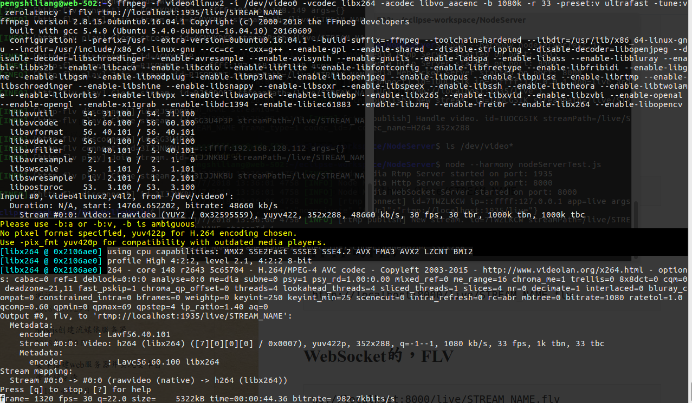

## 系统：linux

## npm安装
Ubuntu：
```bash
# 安装 npm
sudo apt-get install npm 
# npm 升级
sudo npm install -g npm
# 切换到淘宝镜像源
npm install -g cnpm --registry=http://registry.npm.taobao.org
```
<!--more-->

## 安装express

```bash
# 先安装generator
sudo npm install -g express-generator
# 安装express
sudo npm instal -g express
```

## 通过express创建工程
```bash
# 新建工程
express --view=ejs nodeServer
# 进入到工程目录
cd nodeServer
```
```json
<!-- 打开 package.json 并在dependencies 添加相关依赖 --> 
{
  "name": "nodeServer",
  "version": "0.0.0",
  "private": true,
  "scripts": {
    "start": "node ./bin/www"
  },
  "dependencies": {
    "cookie-parser": "~1.4.3",
    "debug": "~2.6.9",
    "ejs": "~2.5.7",
    "express": "~4.16.0",
    "http-errors": "~1.6.2",
    "morgan": "~1.9.0",
    "node-media-server": "~1.4.3"
  }
}
```
```bash
# 利用npm安装所有依赖
npm install 
# 至此 node.js 环境配置完成
```
在NodeServer文件夹中新建js文件，如：nodeServerTest.js
并设置内容如下
```js
const { NodeMediaServer } = require('node-media-server');

const config = {
  rtmp: {
    port: 1935,
    chunk_size: 60000,
    gop_cache: true,
    ping: 60,
    ping_timeout: 30
  },
  http: {
    port: 8000,
    allow_origin: '*'
  }
};

var nms = new NodeMediaServer(config);
nms.run();
```
在该文件夹下终端运行如下指令：
```bash
# 以非严格模式运行
node --harmony nodeServerTest.js
```
得到结果如下：

至此，node.js已创建服务器，相关端口参数如果后来者不明白，自己百度科普
## 安装ffmpeg并推送流数据
Ubuntu下安装ffmpeg比较方便：
```bash
sudo apt-get install ffmpeg
```
查找摄像头设备：
```bash
sudo ls /dev/video*
# 若只有一个摄像头，得到的一般是 /dev/video0
```
ffmpeg推送流
```bash
ffmpeg -f video4linux2 -i /dev/video0 -vcodec libx264 -acodec libvo_aacenc -b 1080k -r 33 -preset:v ultrafast -tune:v zerolatency -f flv rtmp://localhost:1935/live/STREAM_NAME
# 附注：在Windows系统下，-f后面的参数多为dshow，-i后面的参数video="摄像头名":audio="麦克风名"，在Windows系统中，多为虚拟设备
```
运行效果如下：

[参考链接](https://oainin.wordpress.com/2018/06/09/nodejs%E5%88%9B%E5%BB%BA%E6%B5%81%E5%AA%92%E4%BD%93%E6%9C%8D%E5%8A%A1%E5%99%A8/) 
链接备用：（https://oainin.wordpress.com/2018/06/09/nodejs%E5%88%9B%E5%BB%BA%E6%B5%81%E5%AA%92%E4%BD%93%E6%9C%8D%E5%8A%A1%E5%99%A8/）
至此在其他主机上能够访问实时流
## 在网页上访问流数据
新建html文件，如：videoPlay.html
```html
<!-- 将192.168.128.112换成服务器实际ip -->
<script src="https://cdn.bootcss.com/flv.js/1.4.0/flv.min.js"></script>
<video id="videoElement" width="720" height="400" controls></video>
<script>
    if (flvjs.isSupported()) {
        var videoElement = document.getElementById('videoElement');
        var flvPlayer = flvjs.createPlayer({
            type: 'flv',
            url: 'http://192.168.128.112:8000/live/STREAM_NAME.flv'
        });
        flvPlayer.attachMediaElement(videoElement);
        flvPlayer.load();
        flvPlayer.play();
    }
</script>
```
用浏览器打开该html文件即可实时查看流数据。
<span style='color:red'>
1、视频延迟比较久，原因暂未知，貌似和缓冲区大小无关
2、打开的浏览器用高端点的，需要能够支持html5，否则自己该页面代码
3、视频未加载音频，若需加载详情百度ffserver.conf相关配置以及linux音频输入设备查找
</span>